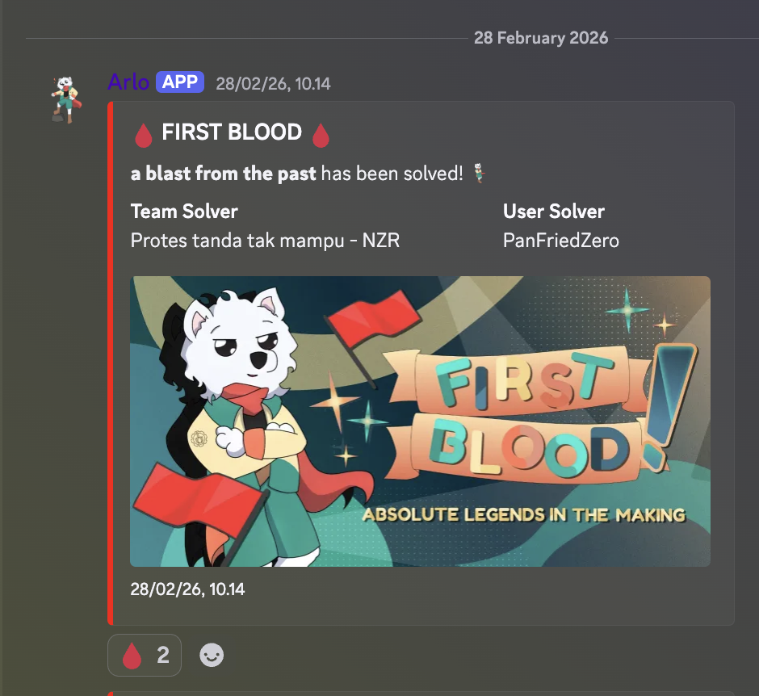

> Note: I solved this challenge with LLM

This challenge looked simple at first: run the binary, enter three inputs, and move on.

That impression disappears very quickly.

The binary has a very old-school feel, and the “back in time” hint is not decorative at all. The validation is split across multiple layers:

- normal PE-side logic
- a hidden DOS loader
- a TEA-based secret for part 1
- a xorshift stream check for part 2
- a ChaCha-based routine that drops `runme.com`

So this is not a one-layer crackme. It is a small chain of reverse problems packed into one binary.

I also got first blood on this challenge:



## Challenge Information

- Category: Reverse Engineering
- Binary: `chimera.exe`
- Event: Final ARA 7.0
- Flag format: `ARA7{...}`
- Goal: recover the three correct inputs, make the binary generate its final payload, and extract the flag

Final flag:

```text
ARA7{FR44+62 Sumber, Surakarta City, Central Java}
```

## Intro

This challenge is a good reminder that reverse engineering problems often hide the real logic somewhere other than the first place you look.

On the surface, `chimera.exe` is a normal 32-bit Windows PE that asks for three inputs. But the actual solve path is built from multiple eras of execution:

- modern PE validation
- legacy DOS loader behavior
- symmetric decryption
- PRNG-based stream inversion
- final payload extraction

What makes it fun is that every clue points to the next layer cleanly. Once the structure becomes visible, the whole solve path becomes very methodical.

## Recon: What Is Inside the Challenge?

I started with basic fingerprinting:

```bash
file chimera.exe
sha256sum chimera.exe
```

The saved output was:

```text
chimera.exe: PE32 executable for MS Windows 3.10 (console), Intel i386 (stripped to external PDB), 8 sections
ec122b4dc6fdcb8972194999b8b7e347ed8bd5f7d5c1f967e390edb9dcab2a9f  chimera.exe
```

Then a quick `strings` pass:

```bash
strings -n 6 chimera.exe | rg 'ARA7XTEAKEY12345F|Failed to open file|\*\*\*G\.G0\(\)'
```

Output:

```text
ARA7XTEAKEY12345F
/***G.G0()#"5G0/"5"G7&534GVG&)#GUG.4III
Failed to open file
```

That already gives three useful signals:

1. there may be a static key near the DOS-related area
2. there is an obfuscated string that looks like input validation
3. the binary probably writes a file after success

That last string is important. It means solving the challenge is likely not just about printing “correct”, but about unlocking a second-stage artifact.

## Looking at the Binary: What Does the PE Side Validate?

The main input-handling routine sits at:

- `0x004014f0`

Using radare2:

```bash
r2 -A -q -c 's 0x004014f0;pdf' chimera.exe
```

The important part for input #3 looks like this:

```asm
; fcn.004014f0
; loop near 0x004016b4
0x004016c7      xor eax, 0x67
...
0x004016fa      add eax, 0x413020   ; "/***G.G0()#\"5G0/\"5\"G7&534GVG&)#GUG.4III"
0x00401702      cmp dl, al
0x00401704      je 0x401710
0x00401706      mov eax, 0
0x0040170b      jmp 0x4019d3         ; fail
```

This tells us exactly what is happening:

- each byte of input #3 is XORed with `0x67`
- the transformed byte is compared against the obfuscated string in the binary

So input #3 is not hidden behind hashing or crypto. It is just XOR-obfuscated.

The same routine also contains the payload generation logic:

```asm
; fcn.004014f0
; around 0x00401899
0x004018c6      call fcn.00402b68    ; init state
0x004018e3      call fcn.00402be3    ; stream xor/decrypt blob
...
0x00401927      xor eax, 0xffffffef  ; decode filename
...
0x00401962      call fopen
...
0x004019ae      call fwrite          ; write output file
```

So the PE-side flow is:

1. validate all three inputs
2. derive key material
3. decrypt an embedded blob
4. write the output file `runme.com`

That matches the earlier `Failed to open file` string perfectly.

## Bonus: Proof of the “Back in Time” Hint

The most interesting part of the binary is not only inside the PE `.text` section. The DOS load-module area, derived from the MZ header, contains real logic.

A useful disassembly snippet from the DOS loader is:

```asm
; ndisasm -b 16 /tmp/chimera_lm.bin
00000042  B42A              mov ah,0x2a
00000044  CD21              int 0x21            ; get date
00000046  81F9BD07          cmp cx,0x07bd       ; 1981
0000004C  81F9C507          cmp cx,0x07c5       ; 1989
...
0000005E  AC                lodsb
0000005F  30D8              xor al,bl           ; xor 0xAB decode
00000061  AA                stosb
```

The range `0x07BD..0x07C5` is:

- `0x07BD = 1981`
- `0x07C5 = 1989`

So “let’s go back in time” is a direct technical hint. The DOS stage literally checks for a year in the 1980s.

### Simplified pseudocode for DOS stage 1

```c
year = DOS_INT_21h_AH_2Ah().year;
if (year < 1981 || year > 1989) {
    print("NO");
    exit();
}

for (i = 0; i < 0x1ab; i++) {
    stage2[i] ^= 0xAB;
}

jump_to(stage2);
```

### Simplified pseudocode for DOS stage 2

```c
read(user, 0x60);                 // input #2, length 96

bx = seed16;
for (i = 0; i < 0x60; i++) {
    bx = xorshift16(bx);          // bx ^= bx<<7; bx ^= bx>>9; bx ^= bx<<8
    decoded[i] = user[i] ^ (bx & 0xff);
}

if (decoded == target_96_bytes) print("OK");
else print("NO");
```

This is the moment where the challenge structure becomes clear:

- input #3 is exposed in the PE layer
- input #1 and #2 are hidden in the DOS layer

## Exploit Core: Recovering the Three Inputs

In a reverse challenge like this, the “exploit” is really the full inversion of the validation pipeline until the binary is forced to reveal its final payload.

### 1. Recover input #3 from the XOR check

The obfuscated string can be decoded directly:

```bash
python3 - <<'PY'
s='/***G.G0()#"5G0/"5"G7&534GVG&)#GUG.4III'
print('decoded_part3 =', ''.join(chr(ord(c)^0x67) for c in s))
PY
```

Output:

```text
decoded_part3 = HMMM I WONDER WHERE PARTS 1 AND 2 IS...
```

So input #3 is:

```text
HMMM I WONDER WHERE PARTS 1 AND 2 IS...
```

### 2. Recover input #1 from the TEA block in the DOS load module

Important data:

```text
tea_key @ lm+0x24a = b'ARA7XTEAKEY12345'
tea_ct  @ lm+0x25a = 46b5d29c9b71e5e5
```

Using standard 32-round TEA decryption, the plaintext becomes:

```text
FLARE-ON
```

So input #1 is:

```text
FLARE-ON
```

### 3. Recover input #2 by inverting the xorshift stream

After decoding the hidden DOS stage with XOR `0xAB`, the important fields are:

- a 16-bit seed at offset `0x19a`
- a 96-byte target buffer at offset `0x13a`

The transformation is:

```text
target[i] = input[i] ^ (xorshift16(state) & 0xff)
```

So inversion is immediate:

```text
input[i] = target[i] ^ (xorshift16(state) & 0xff)
```

The recovered second input is:

```text
DOT COM ISNT JUST FOR WEBSITE BTW. MAYBE PIECE TOGETHER WHERE YOU ARE CURRENTLY AND THAT HINT???
```

That sentence is also a clue for the final stage. The words “DOT COM” are not about websites here. They point to the dropped `runme.com` file.

## Solver: Full Automation from Binary to Flag

I attached the solver as [solve.py](./solve.py). The full script is included below as well.

```python
#!/usr/bin/env python3
"""
Solver for the ARA7 reverse challenge "chimera.exe".

Approach:
1) Recover input #1 from hidden DOS TEA block.
2) Recover input #2 from hidden DOS xorshift stream logic.
3) Recover input #3 from PE-side XORed hint string.
4) Feed all 3 inputs to chimera.exe (via wine) to generate runme.com.
5) Decode flag from runme.com.
"""

from __future__ import annotations

import argparse
import os
import struct
import subprocess
from pathlib import Path


PART3_ENC = b'/***G.G0()#"5G0/"5"G7&534GVG&)#GUG.4III'


def u16(data: bytes, off: int) -> int:
    return struct.unpack_from("<H", data, off)[0]


def extract_dos_load_module(pe: bytes) -> bytes:
    # Parse the MZ fields and extract the DOS load module, not the PE sections.
    cblp = u16(pe, 0x02)
    cp = u16(pe, 0x04)
    cparhdr = u16(pe, 0x08)
    if cblp == 0:
        cblp = 512
    file_size_dos = (cp - 1) * 512 + cblp
    header_size = cparhdr * 16
    return pe[header_size:file_size_dos]


def tea_decrypt_block(
    v0: int,
    v1: int,
    key_words: tuple[int, int, int, int],
) -> tuple[int, int]:
    # TEA decryption, 32 rounds.
    delta = 0x9E3779B9
    total = (delta * 32) & 0xFFFFFFFF
    k0, k1, k2, k3 = key_words
    for _ in range(32):
        v1 = (
            v1 - (((v0 << 4) + k2) ^ (v0 + total) ^ ((v0 >> 5) + k3))
        ) & 0xFFFFFFFF
        v0 = (
            v0 - (((v1 << 4) + k0) ^ (v1 + total) ^ ((v1 >> 5) + k1))
        ) & 0xFFFFFFFF
        total = (total - delta) & 0xFFFFFFFF
    return v0, v1


def recover_part1(load_module: bytes) -> str:
    # Key and ciphertext are stored inside the DOS load module.
    key = load_module[0x24A:0x25A]
    ct = load_module[0x25A:0x262]
    k = struct.unpack("<4I", key)
    v0, v1 = struct.unpack("<2I", ct)
    p0, p1 = tea_decrypt_block(v0, v1, k)
    return struct.pack("<2I", p0, p1).decode("ascii")


def xorshift16_step(x: int) -> int:
    # PRNG used by the hidden DOS stage.
    x &= 0xFFFF
    x ^= (x << 7) & 0xFFFF
    x ^= x >> 9
    x ^= (x << 8) & 0xFFFF
    return x & 0xFFFF


def recover_part2(load_module: bytes) -> str:
    lm = bytearray(load_module)
    stage_off = 0x270
    stage_len = 0x1AB

    # Decrypt the hidden DOS stage first.
    for i in range(stage_off, stage_off + stage_len):
        lm[i] ^= 0xAB

    # Extract the seed and target buffer.
    seed = u16(lm, stage_off + 0x19A)
    target = bytes(lm[stage_off + 0x13A:stage_off + 0x13A + 0x60])

    # Invert the stream XOR.
    out = bytearray()
    state = seed
    for b in target:
        state = xorshift16_step(state)
        out.append(b ^ (state & 0xFF))
    return out.decode("ascii")


def recover_part3(pe: bytes) -> str:
    # The marker string lives in the PE-side data.
    if PART3_ENC not in pe:
        raise ValueError("Could not locate part #3 encoded marker in binary.")
    return bytes(c ^ 0x67 for c in PART3_ENC).decode("ascii")


def run_chimera(
    binary_path: Path,
    part1: str,
    part2: str,
    part3: str,
    cwd: Path,
) -> None:
    # Feed the three recovered answers to the binary.
    stdin_data = f"{part1}\n{part2}\n{part3}\n".encode("utf-8")
    env = os.environ.copy()
    env["WINEDEBUG"] = "-all"
    subprocess.run(
        ["wine", str(binary_path)],
        cwd=str(cwd),
        input=stdin_data,
        stdout=subprocess.DEVNULL,
        stderr=subprocess.DEVNULL,
        check=False,
        env=env,
    )


def decode_flag_from_runme(runme: bytes) -> str:
    # The flag lives in runme.com[0x1f:0x51], XORed with 0x67.
    if len(runme) < 0x51:
        raise ValueError("runme.com too short.")
    return bytes(b ^ 0x67 for b in runme[0x1F:0x51]).decode("ascii")


def main() -> None:
    parser = argparse.ArgumentParser(
        description="Solve chimera.exe and recover the ARA7 flag."
    )
    parser.add_argument(
        "binary",
        nargs="?",
        default="chimera.exe",
        help="Path to the challenge binary",
    )
    parser.add_argument(
        "--runme-path",
        default="runme.com",
        help="Path to runme.com output",
    )
    parser.add_argument(
        "--skip-run",
        action="store_true",
        help="Only decode an existing runme.com file",
    )
    args = parser.parse_args()

    binary_path = Path(args.binary).resolve()
    pe = binary_path.read_bytes()
    load_module = extract_dos_load_module(pe)

    part1 = recover_part1(load_module)
    part2 = recover_part2(load_module)
    part3 = recover_part3(pe)

    runme_path = Path(args.runme_path)
    if not runme_path.is_absolute():
        runme_path = (binary_path.parent / runme_path).resolve()

    if not args.skip_run:
        run_chimera(binary_path, part1, part2, part3, binary_path.parent)

    runme = runme_path.read_bytes()
    flag = decode_flag_from_runme(runme)

    print(f"[+] part1: {part1}")
    print(f"[+] part2: {part2}")
    print(f"[+] part3: {part3}")
    print(f"[+] flag: {flag}")


if __name__ == "__main__":
    main()
```

## Running the Solver

In my archived notes, the solver was run with `--skip-run` because `runme.com` had already been generated:

```bash
python3 solve.py --skip-run
```

Saved output:

```text
[+] part1: FLARE-ON
[+] part2: DOT COM ISNT JUST FOR WEBSITE BTW. MAYBE PIECE TOGETHER WHERE YOU ARE CURRENTLY AND THAT HINT???
[+] part3: HMMM I WONDER WHERE PARTS 1 AND 2 IS...
[+] flag: ARA7{FR44+62 Sumber, Surakarta City, Central Java}
```

At that point, the entire recovery chain is confirmed.

## Verifying the Shape of `runme.com`

A quick hex dump of the first bytes of the dropped file looked like this:

```bash
xxd -g 1 -l 96 runme.com
```

Saved output:

```text
00000000: be 1f 01 b9 32 00 b0 67 30 04 46 e2 fb ba 1f 01  ....2..g0.F.....
00000010: b9 32 00 bb 01 00 b4 40 cd 21 b8 00 4c cd 21 26  .2.....@.!..L.!&
00000020: 35 26 50 1c 21 35 53 53 4c 51 55 47 34 12 0a 05  5&P.!5SSLQUG4...
00000030: 02 15 4b 47 34 12 15 06 0c 06 15 13 06 47 24 0e  ..KG4........G$.
00000040: 13 1e 4b 47 24 02 09 13 15 06 0b 47 2d 06 11 06  ..KG$......G-...
00000050: 1a                                               .
```

The structure matches the reversed logic:

- first `0x1f` bytes: tiny stub
- next `0x32` bytes: XORed flag content

## Flag

```text
ARA7{FR44+62 Sumber, Surakarta City, Central Java}
```

## Final Thoughts

This challenge is a very good reminder not to stop at the layer that looks most obvious.

On the surface, it is just a PE binary with three prompts. Once you dig deeper, it becomes a chain of:

- hidden DOS logic
- an 80s-themed time gate
- a TEA block
- a small stream inversion problem
- a PE-side payload dropper

For practice, this challenge is especially good if you want to train three habits:

1. Write your own TEA decryption from scratch instead of copying a library.
2. Parse the MZ header yourself and extract the DOS load module manually.
3. Rebuild the solver in another language like Rust or Go as a binary-format exercise.

## References

- [The Tiny Encryption Algorithm (TEA)](https://www.cl.cam.ac.uk/ftp/papers/djw-rmn/djw-rmn-tea.html)
- [x86 and amd64 instruction reference](https://www.felixcloutier.com/x86/)
- [Microsoft PE format documentation](https://learn.microsoft.com/en-us/windows/win32/debug/pe-format)
- [The Radare2 Book](https://book.rada.re/)
