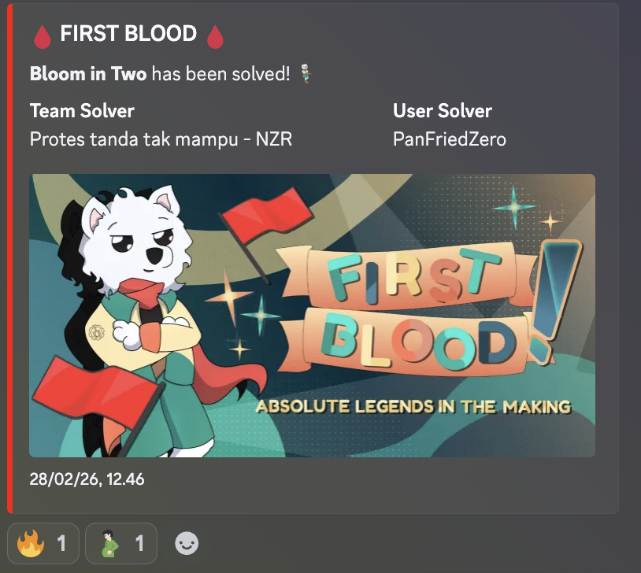

> Note: I solved this challenge with LLM

This was one of the nicer finals crypto tasks because it split the solve into two very different stages. Phase 1 looked like RSA with a partial leak of the private exponent. Phase 2 looked like noisy linear algebra with an oracle that only revealed the top bits of a modular expression.

Both stages were solvable, but neither wanted a brute-force approach. The intended path was to turn phase 1 into a bounded discrete log problem, then turn phase 2 into a small-error linear system and recover the hidden vector with lattice help.

I also managed to get first blood on this challenge:



## Challenge Information

- Category: Cryptography
- Difficulty: Hard
- Event: Final ARA 7.0
- Service: `nc chall-ctf.ara-its.id 2407`
- Attachments / source code: `chall.py`
- Goal: clear phase 1 and phase 2, then submit the correct digest to get the flag

The final flag was:

```text
ARA7{fyi_aja_ini_chall_harusnya_buat_quals_WKWKWKWKWKWK_yaaa_semoga_ga_segampang_itu_yang_penting_ga_pure_sloppable_:sob:}
```

## Initial Analysis

The challenge script prints three public values at the start of phase 1:

```python
print("N =", inst["N"])
print("e =", inst["e"])
print("d_hi =", inst["d_hi"])
print("d_lo =", inst["d_lo"])
```

That immediately tells us the problem is not standard RSA. The server is openly leaking part of the private exponent `d`.

Reading the key generation code shows the custom structure:

```python
p = 2 * g * a + 1
q = 2 * g * b + 1
N = p * q
lcm = 2 * g * a * b
d = getPrime(d_bits)
e = inverse(d, lcm)
```

A few details matter a lot here:

- `N` is 512 bits.
- `d` is only 128 bits.
- `m = 76` and `l = 0`, so only the top 76 bits of `d` are leaked.
- That leaves `128 - 76 = 52` unknown low bits.
- `d_lo` is printed, but because `l = 0`, it is just `0` and gives no extra help.

So phase 1 is really: recover a 128-bit private exponent when the top 76 bits are known and the bottom 52 bits are missing.

Phase 2 is completely different. The server generates a secret vector `B` of length 10 over a 256-bit prime field, then lets us query an oracle 36 times:

```python
coeffs, pad, mask = derive(salt_hex, i, token, 10, 8, shift)
mix = sum(c * b for c, b in zip(coeffs, B)) % q
leak = ((mix + pad) % q) >> shift
echo = leak ^ mask
print("echo =", echo)
```

At a glance it looks noisy, but the important fact is that `salt` is public and `token` is chosen by us. That means we can recompute `coeffs`, `pad`, and `mask` locally for every sample.

## Recon / Enumeration

Since the service was already down, recon here means reading the protocol from source and understanding what information each stage leaks.

### Phase 1 observations

The challenge asks us to decrypt three random ciphertexts:

```python
target_str = os.urandom(16).hex()
m = bytes_to_long(target_str.encode())
ct_m = pow(m, inst["e"], inst["N"])
```

If we recover the full `d`, phase 1 is trivial:

```python
m = pow(ct_m, d, N)
```

So the real problem is private-key recovery, not message recovery itself.

### Phase 2 observations

The second phase prints:

- `q`
- `shift`
- `n`
- `samples`
- `salt`

Then it accepts 36 `tune` values from us. Because `derive()` depends only on `salt`, the sample index, and our chosen token, we fully control the linear coefficients being used by the oracle.

The provided solver simply sets every token to `0`, which is enough.

## Vulnerability Discovery

There are two distinct weaknesses, one in each phase.

### Phase 1: partial private key exposure becomes an interval DLP

Let:

```text
d = D + x
```

where `D = d_hi << 52` is the known part and `x` is the unknown 52-bit suffix.

Because `d` is an odd prime, the missing part must also be odd, so we can write:

```text
x = 2y + 1
```

with:

```text
0 <= y < 2^51
```

That halves the search space immediately.

Now look at the RSA relation. Since:

```text
e * d ≡ 1 (mod lcm)
```

we get:

```text
2^(e*d) ≡ 2 (mod N)
```

for any base coprime to `N`, and `2` is enough here.

Substitute `d = D + 2y + 1`:

```text
2^(e(D + 2y + 1)) ≡ 2 (mod N)
```

Rearranging gives:

```text
g^y = t (mod N)
```

with:

```python
g0 = pow(2, e, N)
g = pow(g0, 2, N)
t0 = (2 * inverse(pow(2, e * D, N), N)) % N
t = (t0 * inverse(g0, N)) % N
```

This is no longer a generic RSA attack. It is a bounded discrete logarithm over the interval:

```text
0 <= y < 2^51
```

That is exactly what the included `bsgs_interval64.c` helper is for.

### Phase 2: the oracle hides only 8 bits per equation

After we recompute the mask, each response becomes:

```text
leak_i = echo_i ^ mask_i
```

and from the server logic:

```text
leak_i = ((mix_i + pad_i) mod q) >> 8
```

So we know every value except the lowest 8 bits. That means for each sample there exists some:

```text
u_i in [0, 255]
```

such that:

```text
mix_i = rhs_i + u_i (mod q)
```

where:

```text
rhs_i = (leak_i << 8) - pad_i
```

Since `mix_i = sum(c_ij * B_j) mod q`, we get a linear system:

```text
C * B ≡ rhs + u (mod q)
```

The vector `u` is small. That is the leakage. The hard part is recovering those missing low bytes.

## Exploitation

## Step 1: Recover the full private exponent `d`

The solver reads `N`, `e`, and `d_hi`, then forms:

```python
D = d_hi << 52
g0 = pow(2, e, N)
g = pow(g0, 2, N)
inv_2eD = pow(pow(2, e * D, N), -1, N)
t0 = (2 * inv_2eD) % N
t = (t0 * pow(g0, -1, N)) % N
```

At this point we need to solve:

```text
g^y = t mod N
```

for `0 <= y < 2^51 - 1`.

The included C helper runs baby-step giant-step over a bounded interval, which is much faster than trying to do this naively in Python. Once `y` is found:

```python
d = D + (2 * y + 1)
```

and the solver verifies it with:

```python
pow(2, e * d, N) == 2
```

That check is useful because if the discrete log stage fails, phase 1 and everything after it will also fail.

## Step 2: Use the recovered `d` to clear phase 1

After reconstructing `d`, the rest of phase 1 becomes plain RSA decryption:

```python
m = pow(ct_m, d, N)
```

The server sends three ciphertexts, and we return the corresponding plaintext integers three times in a row.

This is the point where the challenge changes from key recovery to leakage recovery.

## Step 3: Collect the 36 masked linear samples

For phase 2, the solver chooses:

```python
token = 0
```

for every query. That is enough because the purpose of the token is not to exploit randomness. It is simply to make the generated coefficients reproducible on our side.

For each sample index `i`, we do:

```python
coeffs, pad, mask = derive(salt, i, token, n, 8, shift)
echo = ...
leak = echo ^ mask
rhs = (leak << shift) - pad
rows.append((coeffs, rhs))
```

Now we have 36 equations of the form:

```text
sum(coeffs_i[j] * B[j]) ≡ rhs_i + u_i (mod q)
```

with unknown low byte `u_i`.

## Step 4: Eliminate `B` and isolate the low-byte noise

Let `C` be the `36 x 10` matrix of coefficients. Because there are many more rows than columns, the left kernel of `C` is nontrivial.

The solver computes an LLL-reduced basis for that left kernel:

```python
C = Matrix(ZZ, m, n, [[rows[i][0][j] for j in range(n)] for i in range(m)])
Y = C.left_kernel().basis_matrix().LLL()
```

This is the key move.

From:

```text
C * B - q * w = rhs + u
```

left-multiplying by `Y` removes the `C * B` term entirely:

```text
Y * rhs + Y * u ≡ 0 (mod q)
```

Because `u_i` is only between `0` and `255`, and because `Y` was LLL-reduced, each coordinate of `Y*u` stays small enough that the modular equation can be lifted to an ordinary integer equation. In practice the solver checks the three candidates:

- `residue`
- `residue - q`
- `residue + q`

and keeps the unique one that falls inside the small bound.

That converts the modular problem into a clean integer system for the unknown vector `u`.

## Step 5: Recover the exact low bytes

After the lifting step, the solver has:

```text
Y * u = c
```

over the integers.

This system still has many solutions, so the script finds:

1. one valid integer solution using Smith normal form
2. the right-kernel lattice of `Y`
3. the lattice vector that moves the solution into the valid box `0..255`

That part of the solver is:

```python
Dm, U, V = Y.smith_form()
...
K = Y.right_kernel().basis_matrix().LLL()
...
lattice = IntegerLattice(K)
v = vector(ZZ, lattice.babai(target))
Urec = [int(u0[i] + v[i]) for i in range(m)]
```

Conceptually, this is saying:

- solve the exact linear constraints first
- then use lattice reduction to choose the solution whose entries look like bytes

Once the low-byte vector is recovered, the full linear system is known.

## Step 6: Solve for the secret vector `B`

With the byte corrections in hand:

```text
C * B ≡ rhs + u (mod q)
```

becomes an ordinary linear system over `GF(q)`.

The solver does:

```python
Cg = Matrix(GF(q), m, n, [[rows[i][0][j] for j in range(n)] for i in range(m)])
bvec = vector(GF(q), [(rhs[i] + Urec[i]) % q for i in range(m)])
B = Cg.solve_right(bvec)
```

The recovered `B` is then serialized exactly as the challenge expects:

```python
digest = hashlib.sha256(",".join(str(x) for x in B).encode()).hexdigest()
```

and submitted as the final answer.

## Getting the Flag

After solving both phases, the server prints the flag. The local writeup recorded:

```text
ARA7{fyi_aja_ini_chall_harusnya_buat_quals_WKWKWKWKWKWK_yaaa_semoga_ga_segampang_itu_yang_penting_ga_pure_sloppable_:sob:}
```

So the full solve flow was:

1. read `N`, `e`, and the leaked high bits of `d`
2. turn the unknown 52-bit suffix into a `2^51` interval discrete log
3. reconstruct `d` and answer the three RSA decryptions
4. collect 36 masked linear samples in phase 2
5. unmask them and model the missing part as one unknown byte per equation
6. use the left kernel plus lattice reduction to recover those bytes
7. solve for `B`
8. hash `B` and submit the digest

## Key Takeaways

- Phase 1 teaches that partial private-key leakage does not always lead to brute force. If the algebra is structured enough, it can often be transformed into a different hard problem with a much smaller search interval.
- Phase 2 is a good example of “top bits leak, low bits missing” turning into a hidden small-error problem.
- LLL was not used here as a magic black box. It was used in a very concrete way: first to get short relations from the left kernel, then to navigate the affine solution space until every unknown falls inside the valid byte range.
- The challenge is a nice reminder that mixing two weak constructions does not make the whole system stronger. Here, each phase leaked just enough structure to be solved cleanly.

## Solver Script

For reference, this is the full Python solver used for the challenge. I kept the relative attachment above, but the whole script is included here directly so the post is self-contained.

```python
#!/usr/bin/env python3
import argparse
import hashlib
import os
import re
import socket
import subprocess
import sys
import time
from pathlib import Path

# Sage writes caches in $HOME/.sage; fall back to /tmp in restricted environments.
if not os.access(os.environ.get("HOME", "/tmp"), os.W_OK):
    os.environ["HOME"] = "/tmp"
os.environ.setdefault("DOT_SAGE", "/tmp/.sage")

from sage.all import GF, Matrix, ZZ, vector
from sage.modules.free_module_integer import IntegerLattice

ROOT = Path(__file__).resolve().parent
C_SRC = ROOT / "bsgs_interval64.c"
BSGS_BIN = Path("/tmp/bsgs_interval64")


class Tube:
    def __init__(self, sock: socket.socket):
        self.s = sock
        self.buf = b""

    def recv_until(self, marker: bytes, timeout: float = 20.0) -> bytes:
        end = time.time() + timeout
        while marker not in self.buf:
            left = end - time.time()
            if left <= 0:
                raise TimeoutError(f"timeout waiting for {marker!r}")
            self.s.settimeout(left)
            chunk = self.s.recv(4096)
            if not chunk:
                raise EOFError("connection closed")
            self.buf += chunk
        idx = self.buf.index(marker) + len(marker)
        out = self.buf[:idx]
        self.buf = self.buf[idx:]
        return out

    def recv_line(self, timeout: float = 20.0) -> bytes:
        return self.recv_until(b"\n", timeout)

    def send_line(self, text: str):
        self.s.sendall(text.encode() + b"\n")


def parse_int_line(line: bytes) -> int:
    m = re.search(rb"=\s*(-?\d+)", line)
    if not m:
        raise ValueError(f"cannot parse int from line: {line!r}")
    return int(m.group(1))


def ensure_bsgs_binary():
    if BSGS_BIN.exists():
        return
    cmd = [
        "gcc",
        "-O3",
        "-march=native",
        "-pipe",
        str(C_SRC),
        "-I/usr/include/x86_64-linux-gnu",
        "-L/usr/lib/x86_64-linux-gnu",
        "-lgmp",
        "-o",
        str(BSGS_BIN),
    ]
    subprocess.check_call(cmd)


def derive(salt_hex: str, idx: int, token: int, n: int, coeff_bits: int, shift: int):
    seed = f"{salt_hex}|{idx}|{token}".encode()
    stream = hashlib.shake_256(seed).digest(4 * n + 16)
    span = 1 << coeff_bits

    coeffs = []
    ptr = 0
    for _ in range(n):
        x = int.from_bytes(stream[ptr : ptr + 4], "big")
        ptr += 4
        coeffs.append((x % (2 * span + 1)) - span)

    pad_raw = int.from_bytes(stream[ptr : ptr + 8], "big")
    mask_raw = int.from_bytes(stream[ptr + 8 : ptr + 16], "big")
    pad = pad_raw & ((1 << shift) - 1)
    mask = mask_raw & ((1 << 48) - 1)
    return coeffs, pad, mask


def recover_d_phase1(N: int, e: int, d_hi: int) -> int:
    D = d_hi << 52

    g0 = pow(2, e, N)
    inv_2eD = pow(pow(2, e * D, N), -1, N)
    t0 = (2 * inv_2eD) % N
    g = pow(g0, 2, N)
    t = (t0 * pow(g0, -1, N)) % N

    ub = (1 << 51) - 1
    out = subprocess.check_output(
        [str(BSGS_BIN), str(N), str(g), str(t), "0", str(ub)], text=True, timeout=65
    ).strip()
    y = int(out)
    if y < 0:
        raise RuntimeError("interval DLP failed")

    d = D + (2 * y + 1)
    if pow(2, e * d, N) != 2:
        raise RuntimeError("invalid d recovered")
    return d


def recover_B_phase2(q: int, rows):
    m = len(rows)
    n = len(rows[0][0])

    C = Matrix(ZZ, m, n, [[rows[i][0][j] for j in range(n)] for i in range(m)])
    Y = C.left_kernel().basis_matrix().LLL()
    rhs = [rows[i][1] for i in range(m)]

    cvals = []
    for r in range(Y.nrows()):
        y = [int(v) for v in Y.row(r)]
        bound = 255 * sum(abs(a) for a in y)
        residue = (-sum(y[i] * rhs[i] for i in range(m))) % q
        candidates = [u for u in (residue, residue - q, residue + q) if -bound <= u <= bound]
        if len(candidates) != 1:
            raise RuntimeError("ambiguous modular lift in phase2")
        cvals.append(int(candidates[0]))

    cv = vector(ZZ, cvals)
    Dm, U, V = Y.smith_form()
    cp = U * cv
    rankY = Y.rank()

    w0 = [0] * m
    for i in range(rankY):
        di = int(Dm[i, i])
        ci = int(cp[i])
        if di == 0 or ci % di != 0:
            raise RuntimeError("no integer solution in phase2")
        w0[i] = ci // di

    u0 = vector(ZZ, [sum(int(V[i, j]) * w0[j] for j in range(m)) for i in range(m)])
    K = Y.right_kernel().basis_matrix().LLL()

    target = vector(ZZ, [127 - int(u0[i]) for i in range(m)])
    lattice = IntegerLattice(K)
    v = vector(ZZ, lattice.babai(target))
    Urec = [int(u0[i] + v[i]) for i in range(m)]

    if not all(0 <= u < 256 for u in Urec):
        v = vector(ZZ, lattice.approximate_closest_vector(target))
        Urec = [int(u0[i] + v[i]) for i in range(m)]
        if not all(0 <= u < 256 for u in Urec):
            raise RuntimeError("failed to recover low-byte vector in phase2")

    Cg = Matrix(GF(q), m, n, [[rows[i][0][j] for j in range(n)] for i in range(m)])
    if Cg.rank() < n:
        raise RuntimeError("rank deficient system in phase2")

    bvec = vector(GF(q), [(rhs[i] + Urec[i]) % q for i in range(m)])
    B = Cg.solve_right(bvec)
    return [int(x) for x in B]


def exploit(host: str, port: int):
    ensure_bsgs_binary()

    sock = socket.create_connection((host, port), timeout=8)
    tube = Tube(sock)

    tube.recv_until(b"[phase 1]\n")
    N = parse_int_line(tube.recv_line())
    e = parse_int_line(tube.recv_line())
    d_hi = parse_int_line(tube.recv_line())
    _ = parse_int_line(tube.recv_line())

    st = time.time()
    d = recover_d_phase1(N, e, d_hi)
    print(f"[+] phase1 recovered d in {time.time() - st:.2f}s", file=sys.stderr)

    for _ in range(3):
        tube.recv_until(b"round ")
        tube.recv_line()
        tube.recv_until(b"ct_m = ")
        ct_m = int(tube.recv_line().strip())
        tube.recv_until(b"guess = ")
        m = pow(ct_m, d, N)
        tube.send_line(str(m))
        tube.recv_line()

    tube.recv_until(b"[phase 2]\n")
    q = parse_int_line(tube.recv_line())
    shift = parse_int_line(tube.recv_line())
    n = parse_int_line(tube.recv_line())
    samples = parse_int_line(tube.recv_line())
    salt = tube.recv_line().decode().split("=", 1)[1].strip()

    rows = []
    for i in range(samples):
        tube.recv_until(b"tune = ")
        token = 0
        tube.send_line(str(token))
        tube.recv_until(b"echo = ")
        echo = int(tube.recv_line().strip())
        coeffs, pad, mask = derive(salt, i, token, n, 8, shift)
        leak = echo ^ mask
        rhs = (leak << shift) - pad
        rows.append((coeffs, rhs))

    B = recover_B_phase2(q, rows)
    digest = hashlib.sha256(",".join(str(x) for x in B).encode()).hexdigest()

    tube.recv_until(b"digest = ")
    tube.send_line(digest)

    out = b""
    try:
        while True:
            chunk = sock.recv(4096)
            if not chunk:
                break
            out += chunk
    except Exception:
        pass
    finally:
        sock.close()

    text = out.decode(errors="ignore")
    m = re.search(r"ARA7\{[^\n\r}]*\}", text)
    if m:
        print(m.group(0))
    else:
        print(text)


if __name__ == "__main__":
    parser = argparse.ArgumentParser(description="Solve chall-ctf.ara-its.id:2407")
    parser.add_argument("host", nargs="?", default="chall-ctf.ara-its.id")
    parser.add_argument("port", nargs="?", type=int, default=2407)
    args = parser.parse_args()

    exploit(args.host, args.port)
```

## Final Thoughts

This was one of those crypto tasks where the solver feels satisfying because every line has a purpose. Phase 1 rewards careful algebra. Phase 2 rewards recognizing that the oracle is not really hiding much, only delaying the recovery with a tiny amount of noise.

Even without the remote instance still being online, the local source makes the intended path very clear, and it is a good writeup challenge because it shows two different families of attacks in one problem.
