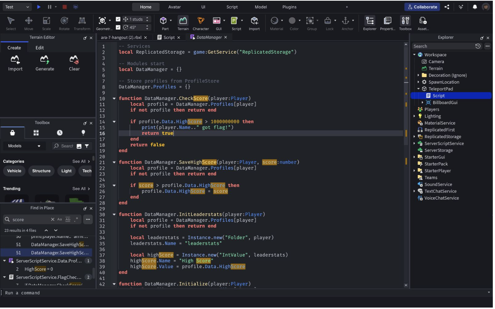
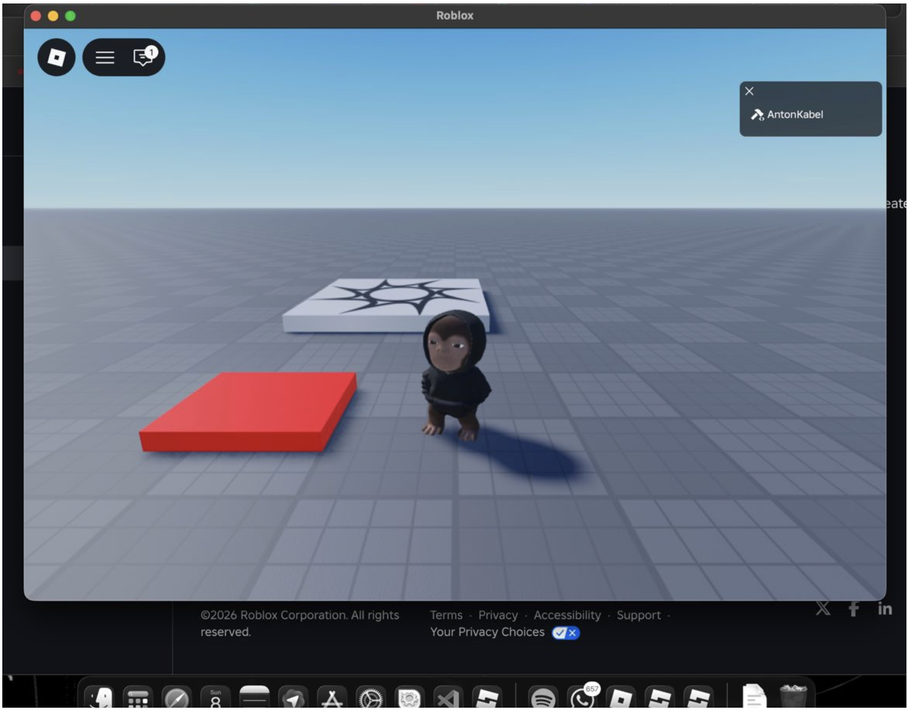
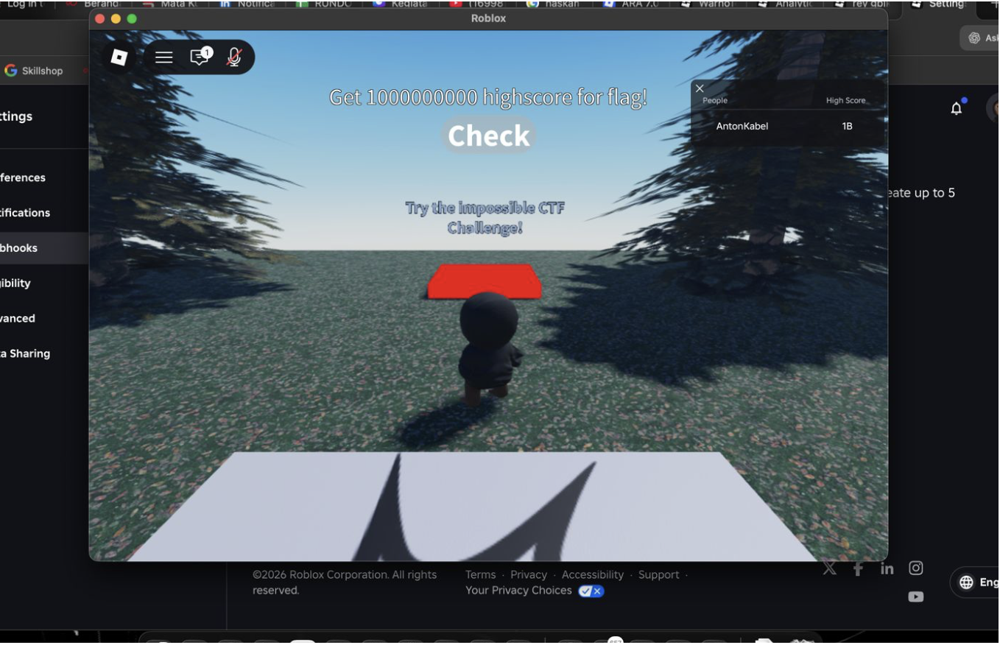

# Hangout

## Intro

This challenge was a nice reminder that not every game-style challenge actually requires you to play the game as intended.

At first glance, the setup looked like a grind challenge inside Roblox: keep clicking, raise your score, and eventually trigger the flag condition. But after looking at the resource code visible in Roblox Studio, it became clear that the server did not care whether a player really clicked one billion times.

What it actually cared about was the saved `HighScore` value in the player profile.

That changes the whole problem. Once the target becomes "set `HighScore` high enough" instead of "earn score legitimately", the right question is no longer about gameplay. It becomes a trust-boundary question: where can that score come from, and can we influence it?

## Recon: What the Server Really Checks

The important logic was inside `DataManager.CheckScore(player)`.

From the resource code visible in Roblox Studio:



The flow was roughly:

- the server loads the player profile from `DataManager.Profiles[player]`
- it reads `profile.Data.HighScore`
- if `profile.Data.HighScore >= 1000000000`, the flag condition is considered satisfied
- the script then logs something like `player.Name .. " got flag!"` and returns `true`

That means the win condition is very simple:

```text
HighScore must be at least 1,000,000,000
```

So the real challenge is not "how do I grind fast enough?" It is "how do I make the server store a fake score that large?"

## The Second Clue: `SaveHighScore` Trusts Incoming Data

The same resource code also showed a save path like this:

- `DataManager.SaveHighScore(player, score)`
- if `score > profile.Data.HighScore`, then `profile.Data.HighScore = score`

That is a very common anti-pattern:

- the server accepts some score value
- the server only checks whether it is higher than the current one
- the server stores it if it wins the comparison

That becomes dangerous if the `score` can be influenced by untrusted external input, such as data passed during place-to-place teleportation.

That is exactly where the challenge opened up.

## The Actual Trick: Abuse `TeleportData`

The intended-looking gameplay path was irrelevant once it became clear that the score could effectively be imported.

The solve idea was:

1. make a Roblox place in Studio
2. create a teleport trigger
3. attach a script that teleports the player into the challenge place
4. set `TeleportData.Score` to a value above `1e9`
5. let the target place trust that incoming score and save it as `HighScore`

So instead of farming the score, the exploit simply injects it at teleport time.

The solution used a teleport box in Roblox Studio with a small Lua script attached to the part.

## Solver Script

I attached the exact Roblox Lua script as [teleport_box.lua](./teleport_box.lua). The full script is included below.

```lua
local TeleportService = game:GetService("TeleportService")
local Players = game:GetService("Players")

local TargetPlaceID = 97219492225892 -- Lobby ARA
local part = script.Parent
local debounce = {}

part.Touched:Connect(function(hit)
    local player = Players:GetPlayerFromCharacter(hit.Parent)
    if not player then return end
    
    if debounce[player] then return end
    debounce[player] = true
    
    local opt = Instance.new("TeleportOptions")
    opt:SetTeleportData({
        Score = 1000000001,
        -- Must be > 1e9
    })
    
    local ok, err = pcall(function()
        TeleportService:TeleportAsync(TargetPlaceID, {player}, opt)
    end)
    
    if not ok then
        warn("Teleport failed:", err)
    end
    
    task.delay(2, function()
        debounce[player] = nil
    end)
end)

Players.PlayerRemoving:Connect(function(p)
    debounce[p] = nil
end)
```

The key part is:

```lua
opt:SetTeleportData({
    Score = 1000000001,
})
```

That is the entire exploit in one line. The score is simply preloaded with a value that already satisfies the server-side threshold.

## Exploitation Flow

The solve flow was straightforward:

1. create or publish the helper Roblox place
2. insert the teleport part and attach the Lua script
3. touch the teleport box in the custom place
4. get moved into the ARA lobby with forged `TeleportData`
5. let the target game read and save the fake score
6. check the flag condition

The teleport setup looked like this during the solve:



After entering the target place and checking the flag condition, the challenge returned the flag:



## Why It Works

The bug is ultimately a trust problem.

The challenge logic assumed that `HighScore` represented something the player had legitimately earned. But the save path accepted a score value that could be influenced through teleport metadata.

So the system trusted the value without proving its origin.

That means the real issue was not math, obfuscation, or client speed. It was:

- untrusted input crossing a game boundary
- becoming trusted profile data
- then being used directly in the flag check

## Pseudocode Summary

The vulnerable logic can be summarized like this:

```text
function CheckScore(player):
    profile = Profiles[player]
    if profile.Data.HighScore >= 1000000000:
        return true
    return false

function SaveHighScore(player, score):
    profile = Profiles[player]
    if score > profile.Data.HighScore:
        profile.Data.HighScore = score
```

And the exploit idea is:

```text
teleport_data.Score = 1000000001
teleport player into target place
server accepts incoming score
HighScore becomes > 1e9
CheckScore passes
```

## Flag

```text
ARA7{c0ngr4tz_0n_f4k1ng_t3l3p0r7}
```

## Closing

This was a good miscellaneous challenge because the solution came from understanding game infrastructure, not from brute-forcing gameplay.

The important lesson is simple:

- if a server stores profile data based on values that can cross place boundaries
- then `TeleportData` is part of the attack surface

Whenever a game challenge checks a stored value instead of a fully server-derived event history, it is worth asking whether that value can be imported, replayed, or faked.

