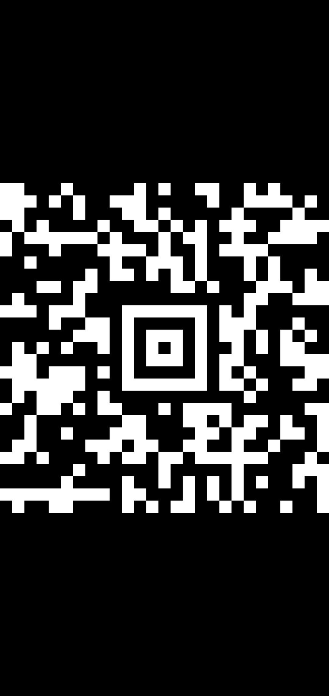

## Challenge Overview

The challenge supplies one artifact, `transmission.wav`, and describes an unscheduled satellite downlink that is still transmitting pictures.

The capture is not ordinary audio steganography. It is a digital SSTV/DRM transmission carrying a monochrome image, and that image contains an Aztec barcode.

The deterministic technique chain is:

1. Validate the WAV container, hash and channel framing
2. Separate the silent framing intervals from the central payload
3. Decode the payload as HAMDRM/DSSTV with QSSTV
4. Treat the reconstructed `.jp2` output according to its actual file magic
5. Decode the recovered Aztec barcode

## Challenge Features

| Feature | Forensic relevance |
|---|---|
| PCM stereo WAV | Gives an exact sample rate and reproducible sample offsets. |
| Repeated long silent intervals | Bound the lead-in, central transmission and tail without guessing an offset. |
| Right channel values only `-1` and `0` | Shows that the right channel is a marker channel, not a second image. |
| Digital multicarrier payload | Matches the HAMDRM/DSSTV receiver path rather than analog SSTV modes. |
| Misleading `.jp2` extension | The reconstructed file is actually a 1-bit PNG, confirmed by `file` and the PNG magic bytes. |
| Aztec barcode | Carries the flag as its decoded text. |

## Artifact Validation

The supplied file is a standard 16-bit, stereo, 48-kHz PCM WAV:

```console
$ file transmission.wav
transmission.wav: RIFF (little-endian) data, WAVE audio, Microsoft PCM, 16 bit, stereo 48000 Hz

$ sha256sum transmission.wav
938a63905c3078f794df96f06a671c955fd0754eec406c225de3d329e13f113a  transmission.wav
```

It contains 1,267,584 stereo frames. The right channel has only the values `-1` and `0`. On the left channel, the long contiguous silent intervals are:

```text
(0, 30720)
(104448, 110592)
(1128192, 1158912)
(1232640, 1267584)
```

At 48 kHz, these intervals bound:

```text
lead-in:  30720 samples  = 0.640 s
payload:  1017600 samples = 21.200 s
tail:     73728 samples  = 1.536 s
```

The payload boundaries are therefore derived from the waveform itself. No random offset, bit alignment or brute-force search is required.

## Initial Analysis

Direct low-bit extraction and file carving do not produce a flag or a normal file header. Common analog SSTV modes such as Martin, Scottie and Robot also do not synchronize.

The central region has a noise-like multicarrier spectrum with coherent pilot-like components. This is consistent with a digital SSTV/DRM waveform. QSSTV is an appropriate decoder because it supports HAMDRM, also called DSSTV, and can receive from a WAV file.

## Decoder Setup

The required local tools are:

```console
$ sudo apt install qsstv xvfb xdotool
$ python3 -m pip install numpy pillow zxing-cpp
```

The tested versions were QSSTV 9.5.8 and ZXing-C++ 3.1.1.

QSSTV is configured with:

```text
transmission mode: DRM
sound input: From file
input clock: 48000 Hz
input file: transmission.wav
```

Internally, QSSTV downsamples the 48-kHz input by four and runs its DRM synchronizer, channel decoder and MOT image reconstruction.

## Recovered Image

QSSTV reconstructs a file named:

```text
20260815175145-payload_raw.jp2
```

The extension is not trustworthy. Its actual type and hash are:

```console
$ file 20260815175145-payload_raw.jp2
PNG image data, 540 x 1140, 1-bit colormap, non-interlaced

$ sha256sum 20260815175145-payload_raw.jp2
48c0ea7a64cde49be1908722f88ec39e7488a60ee257d169fd6c1852e9932176  20260815175145-payload_raw.jp2
```

The recovered image is available here:

[recovered_aztec.png](/static/sniphers-3-ctf/recovered_aztec.png)



The image contains black padding above and below the barcode. The non-black rows are deterministically located at rows 300 through 839, giving a 540×540 barcode region.

## Barcode Decode

The symbol is an Aztec barcode, not a QR code. ZXing-C++ decodes it without guessing:

```python
from PIL import Image
import numpy as np
import zxingcpp

image = Image.open("20260815175145-payload_raw.jp2").convert("RGB")
pixels = np.asarray(image)
gray = np.asarray(image.convert("L"))
rows = np.flatnonzero(np.any(gray > 0, axis=1))
cropped = pixels[rows[0]:rows[-1] + 1, :]

result = zxingcpp.read_barcodes(cropped)[0]
assert result.format == zxingcpp.BarcodeFormat.Aztec
print(result.text)
```

The output is:

```text
$N1PH€RSxTCTF{d1g1t4l_sstv_4zt3c_d0wnl1nk}
```

The decoded value begins with the required literal prefix `$N1PH€RSxTCTF{` and ends with `}`, independently validating the result.

## Solution

| Stage | Evidence-backed operation | Result |
|---|---|---|
| 1 | Parse the WAV and verify its SHA-256 | Correct 48-kHz stereo capture confirmed |
| 2 | Locate long silent runs | Exact lead-in, payload and tail boundaries |
| 3 | Test ordinary audio stego and analog SSTV | No flag and no valid analog SSTV synchronization |
| 4 | Use QSSTV’s DRM/DSSTV receiver | Reconstructed monochrome image |
| 5 | Inspect file magic rather than trusting `.jp2` | Output identified as a 1-bit PNG |
| 6 | Decode the image as Aztec | Exact flag recovered |

## Reproduction

The original writeup references a complete deterministic solver, but the supplied source directory does not contain `solve.py`. The following command transcript documents the intended workflow:

```console
$ python3 -m py_compile solve.py
$ python3 solve.py
capture: /home/abdieeuh/snipher/forensic/transmission.wav
sha256: 938a63905c3078f794df96f06a671c955fd0754eec406c225de3d329e13f113a
format: PCM S16LE, stereo, 48000 Hz
long silent runs: [(0, 30720), (104448, 110592), (1128192, 1158912), (1232640, 1267584)]
candidate image: 20260815175145-payload_raw.jp2 (540x1140)
barcode candidate: Aztec
decoded image: 20260815175145-payload_raw.jp2
flag: $N1PH€RSxTCTF{d1g1t4l_sstv_4zt3c_d0wnl1nk}
```

No malware was executed. No randomness, answer-revealing scoreboard API, or unjustified brute force was used.

## Flag

```text
$N1PH€RSxTCTF{d1g1t4l_sstv_4zt3c_d0wnl1nk}
```
