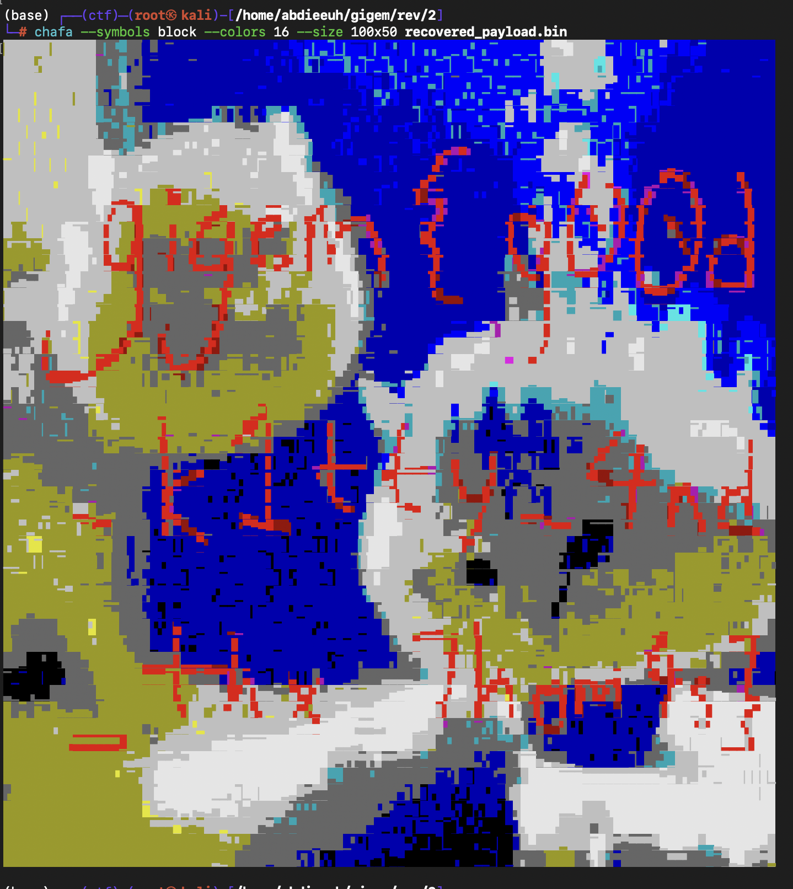

> Note: I solved this challenge with LLM

At first glance this challenge looked like a joke.

The file was a compressed Scratch project, the description was poetic, and the project name was `skretch_FULL.sb3.zstd`. That usually suggests a gimmick, not a serious reverse challenge.

That impression does not last very long.

Once unpacked, the project contains a single sprite with **1,786,279 blocks** and a `project.json` of roughly **372 MB**. The visible Scratch code is heavily obfuscated, the variable names are nonsense, and the block graph is far too large to inspect manually.

But the nice part is that the challenge becomes much cleaner once the structure is visible:

- TurboWarp file picker input
- manual base64 decoding
- a byte transformation
- a giant generated validator
- a unique accepted file
- the flag hidden in the recovered artifact

So this is not a “play the Scratch game” challenge. It is a deterministic constraint-recovery problem disguised as one.

## Challenge Information

- Category: Reverse Engineering
- File: `skretch_FULL.sb3.zstd`
- Flag format: `gigem{...}`
- Goal: reverse the Scratch project, recover the exact file it accepts, and extract the flag

Final flag:

```text
gigem{g00d_k1tty_4nd_thx_7hom4s}
```

## Intro

This challenge is a good example of why generated or visual languages can still hide very normal reverse-engineering structure underneath.

Even though the implementation is Scratch/TurboWarp, the actual solve path is classical:

- identify the input format
- recover the decoding logic
- reduce the validator
- reconstruct the required input
- inspect the recovered output artifact

The only unusual part is scale. The project is not logically complicated, but it is mechanically huge.

## Recon: What Is Inside the Challenge?

I started with basic fingerprinting:

```bash
file skretch_FULL.sb3.zstd
zstd -d -f skretch_FULL.sb3.zstd -o skretch_FULL.sb3
unzip -l skretch_FULL.sb3
```

Saved output:

```text
skretch_FULL.sb3.zstd: Zstandard compressed data (v0.8+), Dictionary ID: None

Archive:  skretch_FULL.sb3
  Length      Date    Time    Name
---------  ---------- -----   ----
     2954  2020-06-08 22:59   927d672925e7b99f7813735c484c6922.svg
    10451  2020-06-08 22:59   beaf987d503696840f625e7fedf704eb.svg
      202  2020-06-08 22:59   cd21514d0531fdffb22204e0ec5ed84a.svg
372227874  2026-02-21 18:15   project.json
```

That is already a strong signal:

- almost the entire challenge is in `project.json`
- the SVG assets are tiny
- the logic is generated rather than hand-authored

After parsing the Scratch JSON, the project structure looked like this:

```text
targets 2
name= Stage isStage= True vars= 5 lists= 1 blocks= 0 costumes= 64 sounds= 0
name= contemplate the mysteries of life isStage= False vars= 0 lists= 1 blocks= 1786279 costumes= 1 sounds= 0
```

So there are only:

- one stage
- one sprite
- one giant generated program

That makes the attack surface much smaller than the raw file size suggests.

## What Does the Main Script Actually Do?

The main top-level Scratch script is short. Once rendered into pseudocode, its behavior becomes clear:

1. show a TurboWarp file picker
2. read the chosen file as a `url`
3. skip forward to the first comma in the returned data URL
4. copy everything after the comma into a string
5. call a custom procedure on that substring
6. mutate the resulting byte list
7. evaluate a giant arithmetic validator
8. print success only if the final accumulator is zero

The relevant beginning looked like this after deobfuscation:

```text
say "My eyesight's gotten worse..."
say "But I can definitely spot a flag when I see one!"
picked = showPickerAs("url")
idx = 1
while picked[idx] != ",":
    idx += 1
idx += 1

payload_b64 = ""
while idx < len(picked) + 1:
    payload_b64 += picked[idx]
    idx += 1

decode_base64(payload_b64)
```

That tells us two important things immediately:

1. the challenge expects a file upload, not direct keyboard input
2. the uploaded bytes are read through a `data:...;base64,...` URL wrapper

So the first stage is just extracting the base64 payload from the file picker result.

## Base64 Decoder Hidden in Scratch

The custom procedure is not random arithmetic. It is a manual base64 decoder.

There are two strong clues:

1. the stage has exactly **64 costumes**
2. the costume names are:

```text
A B C ... Z a b c ... z 0 1 2 ... 9 + /
```

That is the standard base64 alphabet.

The procedure also uses a constant list:

```text
[262144, 4096, 64, 1]
```

which is:

```text
64^3, 64^2, 64^1, 64^0
```

So the decode logic is:

1. process 4 base64 characters at a time
2. turn each character into its alphabet index using backdrop/costume position
3. compute the 24-bit chunk
4. count padding `=`
5. emit `3 - padding` bytes

In simplified pseudocode:

```c
for each 4-char block:
    acc = 0
    pad = 0

    for j in 0..3:
        ch = block[j]
        if ch == '=':
            pad++
            val = 0
        else:
            val = base64_index(ch)
        acc += val * [64^3, 64^2, 64^1, 1][j]

    emit the top (3 - pad) bytes of acc
```

So at this point the project is already no longer “Scratch logic”. It is just a handwritten base64 decoder embedded in Scratch blocks.

## The Post-Decode Byte Transform

After decoding, the program does one more pass over the byte list:

```text
for i in 1..len(list):
    list[i] = (list[i] + i) mod 256
```

That is important because the later equations are not applied to the raw decoded bytes. They are applied to these shifted values.

If we call the decoded bytes `orig[i]`, then the validator sees:

```text
x[i] = (orig[i] + i) mod 256
```

So when the accepted list is recovered, we must undo this at the end:

```text
orig[i] = (x[i] - i) mod 256
```

## The Giant Validator

This is the part that looks impossible if viewed directly inside Scratch.

The main body after decoding contains a chain of **38,566** arithmetic updates. At first glance it is just pages and pages of:

- `change variable by ...`
- nested adds, multiplies, list accesses, and constants
- giant absolute-value expressions

But the end of the chain is the key:

```text
if accumulator == 0:
    say "Looks flaggy!"
else:
    say "Not sure I recognize it..."
```

And every update in the chain has the form:

```text
accumulator += abs(expression)
```

That immediately gives the real condition.

Because the accumulator starts at zero and only ever adds absolute values, the only way to finish with `accumulator == 0` is:

```text
every single inner expression must equal 0
```

That turns the validator into a pure system of equations.

## Reducing the Validator to Equations

I wrote a local extractor to walk the Scratch block graph and simplify the generated arithmetic.

Helper scripts used during the solve:

- `analyze_scratch.py`
- `solve.py`

The extractor pulled out:

```text
collected 38566 raw equations
deduplicated to 38566 equations
variables: 38566 (min=1, max=38566)
```

The surprising result is that every equation is extremely small.

Each one had exactly **three** byte variables, and after simplification looked like:

```text
a_i * x[k] + b_i * x[k+1] + c_i * x[k+2] = d_i
```

For example, the first few extracted equations looked like:

```text
EQ 1  ((11833, 48), (11834, 146), (11835, 132)) const -50246
EQ 2  ((33237, 182), (33238, 82), (33239, 92)) const -33614
EQ 3  ((38189, 208), (38190, 68), (38191, 241)) const -48356
...
```

So the giant validator is not some nonlinear monster. It is a shuffled set of local linear constraints over consecutive triples.

## Why the Solve Is Fast

Once reordered by starting index, the system becomes a linear recurrence.

For starts `1..38564`, there is exactly one equation for each triple:

```text
x[i], x[i+1], x[i+2]
```

except at the boundary, where there are two wrap-around equations involving the end of the list and the first bytes.

That means I do **not** need a general SMT solve over 38,566 variables.

Instead:

1. guess `x[1]` and `x[2]`
2. solve each next byte directly from the recurrence
3. reject immediately if:
   - division is not exact
   - the byte is outside `0..255`
4. at the end, check the two wrap-around equations

So the only search space is:

```text
256 * 256 = 65536
```

which is tiny.

In practice, the pruning is immediate:

```text
survivors after 16 steps: 1
```

That means after only 16 recurrence steps, there was already exactly one valid candidate seed left.

## Solver

I saved a full solver for this challenge.

The solve flow is:

1. parse the Scratch JSON from the `.sb3`
2. recover the base64 decoder structure
3. recover the post-decode byte transform
4. extract all `abs(expr)` constraints
5. reduce them to linear triple equations
6. reorder into recurrence form
7. brute-force `x[1], x[2]`
8. propagate deterministically
9. undo the `+i mod 256` shift
10. write the accepted file

## Running the Solver

I ran:

```bash
python3 solve.py
```

Saved output:

```text
collected 38566 raw equations
deduplicated to 38566 equations
variables: 38566 (min=1, max=38566)
survivors after 16 steps: 1
equations: 38566 raw, 38566 unique
list length: 38566
payload length: 38566
payload prefix: b'\x89PNG\r\n\x1a\n\x00\x00\x00\rIHDR\x00\x00\x01,\x00\x00\x01,\x08\x03\x00\x00\x00N\xa3~'
wrote recovered_payload.bin
```

So the accepted file is not text. It is a PNG.

A quick fingerprint:

```bash
file recovered_payload.bin
sha256sum recovered_payload.bin
```

Output:

```text
recovered_payload.bin: PNG image data, 300 x 300, 8-bit colormap, non-interlaced
11a795b61438c6add4bd83d0177d23a43e8df729b697405de49f39ed2bb562ed  recovered_payload.bin
```

That means the Scratch challenge is really a file-recovery problem whose unique solution is an image file.

## Final Artifact

The recovered accepted payload is:

- `recovered_payload.bin`



And the original challenge file hash was:

```text
b73211c48427248e6ca47645d321f2b211fc627af798f6f0b42059246d95cfcc  skretch_FULL.sb3.zstd
```

So the solve chain is fully reproducible:

- challenge archive
- deterministic solver
- recovered PNG
- final flag

## Flag

```text
gigem{g00d_k1tty_4nd_thx_7hom4s}
```

## Final Thoughts

This challenge is a good reminder that generated visual code is still code.

The Scratch project looks enormous and unreadable at first, but the real structure is simple once extracted:

- a file picker
- a base64 decoder
- a byte shift
- a linear recurrence disguised as arithmetic noise

The nicest part is that the final solve is not brute force in any meaningful sense. The whole monster reduces to a recurrence over bytes, and only the first two values need to be guessed.

If I were cleaning this writeup into a polished post, the next nice additions would be:

1. render one or two original Scratch block regions as screenshots beside the simplified pseudocode
2. add a short section showing how the stage costumes encode the base64 alphabet
3. include a diagram of the recurrence and the two wrap-around equations

## References

- [Scratch project file format](https://en.scratch-wiki.info/wiki/Scratch_File_Format)
- [TurboWarp](https://turbowarp.org/)
- [Base64](https://datatracker.ietf.org/doc/html/rfc4648)
